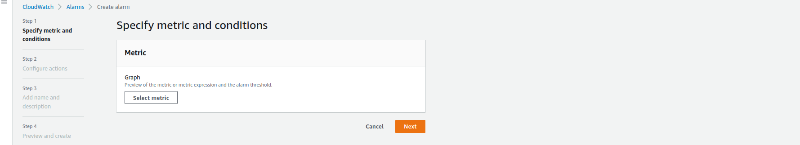

## Serverless Function Providers
- AWS (AWS Lambda)
- Microsoft Azure (Azure Functions)
- iron.io, Cloudflare, OpenFaaS

AWS built-in supports versioning at the moment.
AWS allows https endpoint with API Gateway. Azure with API Management.
AWS has 15minute running time limit. Azure has 10minute limit with option to unlimited
AWS support 1000 concurrent functions (soft limit). Azure 10 concurrent instances 

- iron.io - has iron workers like serverless function. Runtime limit to 60min. Doesnt have a lot of services.
- Cloudflare workers - run js code close to users loading website. AWS has lambda at edge
- OpenFaaS - 

## Client: Globomantics Pet Care
- website uptime monitoring - Simple scheduled events
- social media automation - 3rd party APIs
- custom bussiness reminders - Bussiness logic and AWS SES email reminders
- new customer service - Serverless service with serverless framework

### LambdaCanary project
- Set run interval
- Function reviews website
- Website status recorded. If fails we use cloudwatch alarms
### Twitter bot
- Every hour tweet
- Connect with API keys
- We will randomize tweets with python
### Workflow automation
- Run bussines logic on trigger.
- Depending the time of day. Come to work, work, pickup pets
### New Customers Service - whenever new customer added
- Through API Gateway
- process lambda function
- validate reuqest
- save in DynamoDb

## AWS - Free Tier - 12 Months
- Amazon EC2
- DynamoDB
- SimpleEmail Service
- Lambda
- Relational Database Service
- Simple Storage Service

To AWS bar add
- Lambda
- Iam - Users, Groups (just add users), Roles. Roles are assigned to users
- Simple Email Service
- Systems Manager - for API key
- ApiGateway
- DynamoDB

IAM policy is JSON
```
{
    "Version": "2012-10-17",
    "Stetement": [
        {
            "Effect": "Allow",
            "Action": "*",
            "Resource": "*"
        }
    ]
}
```

IAM best practices
- Strong password
- Two-factor authentication
- Principle of Least Privilege
- Root account caution. Instead, create admin account

On AIM
There are policies, managed by AWS. We will use it
We can create policy or policy generator
Go to AWS policy generator on goongle
Pick IAM Policy
Allow
Actions: SendEmail, SendRawEmail,
Amazon Resource Name ARN - *
Add statement
Generate Policy

Go to AWS
Go to roles 
Select AWS account....
Lambda
Attach policy by create policy, json
copy paste
Review policy
Test policy
go to polies and you will see policy
create role that will be assogned with policy
Roles < in sidebar to see test role


First pick a language and runtime
- Language and 
  - Python     
  - Runtime 3.8
  Node Python Ruby Java Go NetCore(C# and powershell)
  - has custom runtimes like rust c++ Php

Evaluate size limitation. <250mb uncompressed
<50MB compressed
in region <75GB
If this issue, find smaller library or microservice architecture for each step
Maybe other language
Ephemeral storage <512MB
<900s maximum execution duration
<1000 concurent functions
Divide steps. Load and store files in S3, chain functions together
Ask AWS limitations

Memory 128MB-3GB
CPU scales with memory
Virtual Private Cloud VPC - Lambda runs inside VPC but it doesnt have access to your VPC
In that case you have to give access

# Lambda
Lambda is event driven code. Has code size limitation, performance limitation, limited running workload. Lambda are run in EC2 environment. You can make custom configuration

- you can write locally and package it (zip). Upload via website or aws client
- or use lambda AWS editor


Use blueprint

Customize name. 

define schedual


In tab configuration
```
expected    Java Developer
site	    https://github.com/djulbicb
```


Go CloudWatch>Alarms>Create alarm


Select lambda with MetricName:Error


Pick static

Define topic and click `Create topic`

Click next and define name of alarm>
s >Review and Create alarm
Confirm subsription

AmazonSNS 


Change Lamda>lambda_function>Configuration>Environment variables