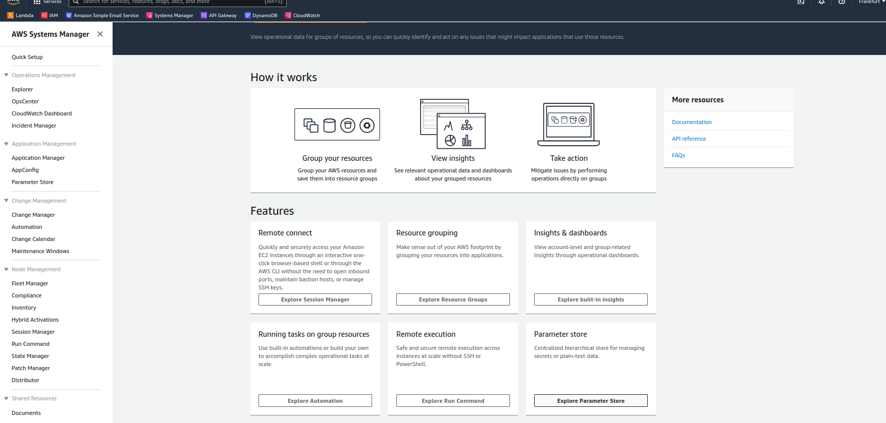
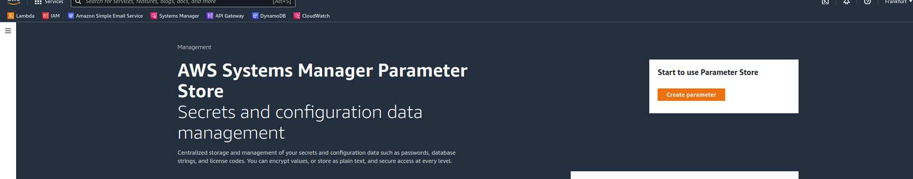
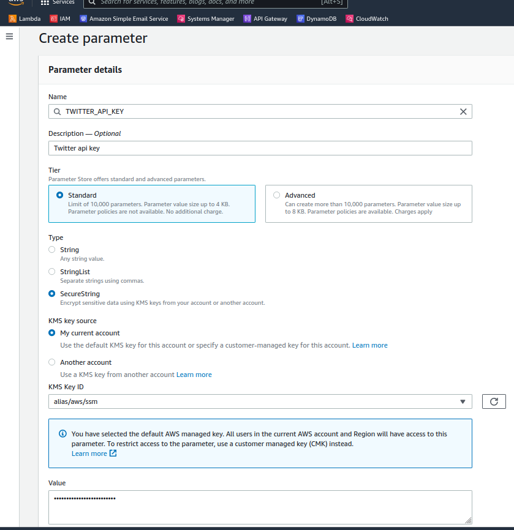
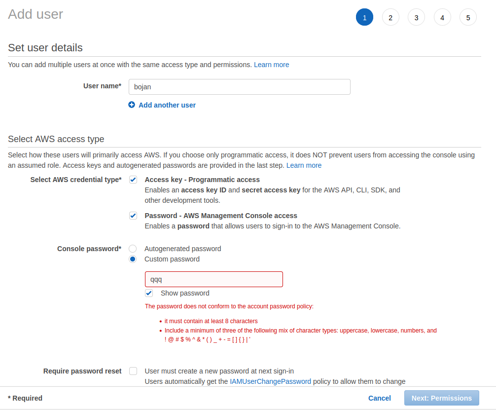
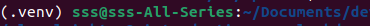

**For Api key managmenet:**
- AWS Sytems Manager Parameteter Store.
- AWS KMS Management Service - paid servide

Lambda will need permission to get keys. 

In System Manager>Explore Parameter Store

Click `Create Parameter`

```
Name:               TWITTER_API_KEY
Type:               SecureString
Value:              xxx
Tags:               app:twitter
KMS key source:     My current account alias/aws/ssm
```
Assign the key to current account `alias/aws/ssm`. Its free.


## Create access AWSCLI keys
- Go to `IAM>User Groups>Create group` 
- Specify name, add policy `AdministratorAccess`
- Click `Create group`
- Go to `IAM>Users>Add users>Add Users`
```
Username:   name
Password:   sifra
programattiac access and AWS management console access
```


- Click next
- `Add user to group`. Add created group
- Next, Review, Create

# Create keys programmatically
We already did it through AWS console. If using python3 use pip3

```
cd sparrow
sudo apt install python3-pip
pip3 install boto3
sudo apt install awscli

aws configure
Access key ID:      xxx
Secret access key:  xxx
region:             eu-central-1
```

## Adding
```
import boto3

def get_secret(parameter_name):
    """Get a parameter from SSM Parameter store and decrypt it"""
    ssm = boto3.client('ssm')
    parameter = ssm.get_parameter(
        Name=parameter_name,
        WithDecryption=True
    )['Parameter']['Value']
    return parameter


def put_secret(parameter_name, parameter_value):
    """Put a parameter inside SSM Parameter store with encryption"""
    print('Putting a parameter with name of ' + parameter_name + ' into SSM.')
    ssm = boto3.client('ssm')
    ssm.put_parameter(
        Name=parameter_name,
        Value=parameter_value,
        Type='SecureString',
        Overwrite=True
    )
    print("Successfully added a parameter with the name of: " + parameter_name)
```

# Custom py virtual environment
Create a clean environment
```
# create environemnt
python3 -m venv .venv

# turn on environment
source .venv/bin/activate
```
Terminal will show up like this



```
pip3 install twython

# install boto3 in virtual env. We have it locally already
pip3 install boto3

# see dependencies
pip3 freeze
```
send tweet
```
#!/usr/bin/env python
import random
from twython import Twython
from ssm_secrets import get_secret

APP_KEY = get_secret('TWITTER_API_KEY')
APP_SECRET = get_secret('TWITTER_API_KEY_SECRET')


# Create the Twython Twitter client using the credentials stored in SSM
twitter = Twython(APP_KEY, APP_SECRET)

# Sample random tweets
potential_tweets = [
    'This is my first tweet with Sparrow by @fmc_sea - https://github.com/fernando-mc/sparrow',
    'Wow! Isn\'t Sparrow by @fmc_sea just the coolest! https://github.com/fernando-mc/sparrow',
    'Jeez! Everyone should learn about AWS Lambda and Twitter Bots from @fmc_sea'
]


def send_tweet(tweet_text):
    """Sends a tweet to Twitter"""
    twitter.update_status(status=tweet_text)


def handler(event, context):
    """Sends random tweet from list of potential tweets"""
    send_tweet(random.choice(potential_tweets))


def follow_someone(screen_name):
    twitter.create_friendship(screen_name=screen_name)


def follow_fernando():
    follow_someone("fmc_sea")


def like_tweet(tweet_id):
    twitter.create_favorite(id=tweet_id)


def like_a_punny_tweet():
    # This awful pun can be viewed here:
    # https://twitter.com/fmc_sea/status/1171113632362577922
    like_tweet("1171113632362577922")
    


auth = twitter.get_authentication_tokens()
OAUTH_TOKEN = auth['oauth_token']
OAUTH_TOKEN_SECRET = auth['oauth_token_secret']
print(OAUTH_TOKEN_SECRET)

twitter.verify_credentials()
# send_tweet('Hello hello')
```

# 
rm -r .venv
rm -r __pycache__
deactive
python3 -m venv .venv
source .venv/bin/activate
mkdir setup
cp sparrow.py setup
cp ssm_secrets. setup
cd setup
# install into local folder
pip3 install -r ../requirements.txt -t .
zip -r ../package.zip ./*
rm -rf ./setup
deactivate
sparrow rm -rf .venv
open .


add role KMS managment service,
ssmFullaccess 
or
ssmReadOnlyAccess

