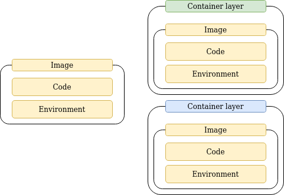

# Images and containers 
Images are blueprints, meat of container. Image contains required tools and container is running unit.  
Container is a running instance of image.

Image consists of layers. When a container is created, a container doesn't copy image layers, instead 
container uses layers from image and appends one layer on top of it. 

So if 3 containers are running, those are not 3 copys.
All 3 containers are using same image layers, but last layer is container specific.
Image layers are read-only. Container layer is write/read.

Every instruction (ie RUN, COPY...) in an image creates a cacheable layer. Layers help with image rebuilding and sharing


```
# container will just close
docker run node

# runs default command
docker run -it node

# overrides default command
docker run -it node bash

# build image
docker build .

# run docker
docker run -p hostPort:containerPort <imageHash or imageName>
```

# Start project
```
npm init
npm install express
npm install body-parser
npm install
```

### app.mjs
```
import express from 'express'
import {body, h1} from './boilerplate.mjs'
import * as html from './boilerplate.mjs'
import bodyParser from 'body-parser'

const app = express()

app.use(bodyParser.json())
app.use(express.static('public'))

let data = {}

app.get("/", (req, res) => {
    console.log("/")

    const lis = Object.keys(data).map(key => {
        return html.li(key + ":" + data[key])
    })
    console.log(lis)

    const content = html.body(html.h1("Hello!") + html.p("Love you <3") + html.ul(lis))
    res.send(content)
})

app.post("/", (req, res) => {
    data = {...data, ...req.body};
    console.log(data);
    res.sendStatus(200);
})

app.listen(3000)
```

### boilerplate.mjs
```
export const body = (content) => {
return `<!DOCTYPE html>
<html lang="en">
  <head>
    <meta charset="UTF-8">
    <meta name="viewport" content="width=device-width, initial-scale=1.0">
    <meta http-equiv="X-UA-Compatible" content="ie=edge">
    <title>HTML 5 Boilerplate</title>
    <link rel="stylesheet" href="styles.css">
  </head>
  <body>
    ${content}
	<script src="index.js"></script>
  </body>
</html>
`
}

export const h1 = (content) => {
    return `<h1>${content}</h1>`
}
export const p = (content) => {
    return `<p>${content}</p>`
}
export const ul = (content) => {
    return `<ul>${content}</ul>`
}
export const li = (content) => {
    return `<li>${content}</li>`
}
```

### Dockerfile
```
FROM node
# All COPY, RUN commands will be triggered in WORKDIR
# First install dependencies and then change files
WORKDIR /bojan
COPY ./package.json /bojan
RUN npm install

COPY . /bojan

# Expose is optional and used only as a documentation reference.
EXPOSE 3000

# CMD command has to be present. If image doesnt have it, cmd from parent image is called
CMD ["node", "app.mjs"]
```

# Docker commands
## --help
Every docker command has `--help` flag that shows all options
```
docker --help
docker run --help
```
## attached/detached
`docker run` by default starts project in `attach` mode. `docker start` start by default in `detached` mode.
```
# start as detached in background
docker run -d <imageId>
# attach to already running 
docker attach <containerIdOrName>
```
Restart containers
```
# restart closed container in detached mode
docker start <containerIdOrName>

# restart closed container in attached mode
docker start -a <containerIdOrName>
docker start --attach <containerIdOrName>
```
## logs
```
docker logs <containerIdOrName>
# follow logs in attached mode
docker logs -f <containerIdOrName>
docker logs --follow <containerIdOrName>
```