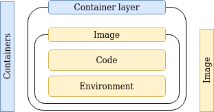
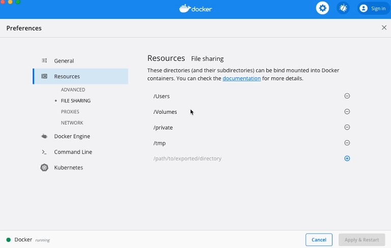

# Data
Different types of data
- Application: Code + Environment. Stored in image layers during image build. Read only.
- Temporary App Data: Read/Write. Produced at runtime. Stored in memory or temporary files. Stored in Containers, in that extra layer.
- Permanent data: Must survive container restarts. Read/Write


# Feedback project
```
npm init
npm install express
npm install body-parser
npm isntall nodemon

npm nodemon server.mjs
```
### package.json
```
{
  "name": "feedback",
  "version": "1.0.0",
  "description": "",
  "main": "index.js",
  "scripts": {
    "start": "nodemon server.mjs",
    "test": "echo \"Error: no test specified\" && exit 1"
  },
  "author": "",
  "license": "ISC",
  "dependencies": {
    "body-parser": "^1.20.0",
    "express": "^4.18.1"
  },
  "devDependencies": {
    "nodemon": "^2.0.19"
  }
}
```
### server.js
```
import express from "express";
import fs from "fs";
import path from "path";
import bodyparser from 'body-parser';
import {fileURLToPath} from 'url';
import { exists } from "fs";

const __filename = fileURLToPath(import.meta.url);
const __dirname = path.dirname(__filename);

const app = express();
app.use(bodyparser.urlencoded({ extended: false }));
app.use(express.static('public'));
app.use('/feedback', express.static('feedback'));

app.get("/", (req, res) => {
    const filepath = path.join(__dirname, 'pages', 'feedback.html');
    console.log(filepath)
    res.sendFile(filepath);
})

app.get("/exists", (req, res) => {
    const filepath = path.join(__dirname, 'pages', 'exists.html');
    return res.sendFile(filepath)
})

app.post("/create", async (req, res) => {
    const title = req.body.title;
    const content = req.body.text;
    const adjTitle = title.toLowerCase();

    const tempFilePath = path.join(__dirname, 'temp', adjTitle + '.txt');
    const finalFilePath = path.join(__dirname, 'feedback', adjTitle + '.txt');

    await fs.writeFile(tempFilePath, content, (e)=>{
        console.log(e)
    });
    exists(finalFilePath, async (exists) => {
        if (exists) {
            res.redirect('/exists');
            return;
        } else {
            await fs.rename(tempFilePath, finalFilePath, (e)=>{console.log(e)});
            res.redirect('/');
            return;
        }
        res.redirect('/');
    });

    
})

app.listen(2000)
```

### feedback.html
```
<!DOCTYPE html>
<html lang="en">
<head>
    <meta charset="UTF-8">
    <meta http-equiv="X-UA-Compatible" content="IE=edge">
    <meta name="viewport" content="width=device-width, initial-scale=1.0">
    <title>Document</title>
    <!-- CSS only -->
    <link href="https://cdn.jsdelivr.net/npm/bootstrap@5.2.0/dist/css/bootstrap.min.css" rel="stylesheet" integrity="sha384-gH2yIJqKdNHPEq0n4Mqa/HGKIhSkIHeL5AyhkYV8i59U5AR6csBvApHHNl/vI1Bx" crossorigin="anonymous">

</head>
<body>
    <div class="container">
        <h1 class="mb-2">Hello love &lt;3</h1>
        <form action="/create" method="POST">
        <div class="form-control mb-2">
            <label for="title">Title</label> <br>
            <input type="text" id="title" name="title" />
        </div>
        <div class="form-control mb-2">
            <label for="text">Document Text</label> <br>
            <textarea name="text" id="text" rows="10"></textarea>
        </div>
        <button class="btn btn-primary">Save</button>
        </form>
    </div>
    
</body>
</html>
```
### Dockerfile
```
FROM node
WORKDIR /app
COPY ./package.json /app/package.json

RUN npm install

COPY . .

EXPOSE 2000

CMD ["node", "server.mjs"]
```

### commands
After container restart file is present in container
```
docker build -t feedback .
docker run -p 3000:2000 -d --name feedback --rm feedback01

http://localhost:3000/feedback/hello.txt

docker stop feedback

docker run -p 3000:2000 -d --name feedback feedback01
- add a file hello.txt
docker stop feedback
docker start feedback
http://localhost:3000/feedback/hello.txt
```
That file is saved in container layer. This layer generated and is tied to lifecycle of container.
If container is deleted, its data will be deleted.

# Volume
Volume is different Copy. Copy just creates snapshot and copies it.
Volumes are folders on host machine and are mounted (made available, mapped) into containers.
Any change in volume folder inside container is reflected outside, and vice-versa.

Volumes can be
- handled by docker: `Named` and `Anonymous` mount. Cant edit directly
- handled by you: `Bind` mounts. Can edit directly

## Volume as a Dockerfile command
Add command `VOLUME ["/app/feedback"]`. This will outsource file handling creating to the file system.
Its small optimization. Now a special volume is created for handling this.
```
FROM node
WORKDIR /app
COPY ./package.json /app/package.json

RUN npm install

COPY . .

VOLUME ["/app/feedback"]

EXPOSE 2000

CMD ["node", "server.mjs"]
```
commands
```
docker build -t feedback02 .
docker run -p 3000:2000 --name feedback --rm -d feedback02
```
If you try to save this you get an error. Cross-device link is not permitted.
Basically copying from docker to host is considered cross-device.
```
# replace
await fs.rename(tempFilePath, finalFilePath, (e)=>{console.log(e)});

# with
await fs.copyFile(tempFilePath, finalFilePath, (e)=>{console.log(e)});
await fs.unlink(tempFilePath, (e)=>{console.log(e)});
res.redirect('/');
return;
```
Rebuild 
```
docker build -t feedback02 .
docker run -p 3000:2000 --name feedback -d feedback02
http://localhost:3000/feedback/q.txt
docker stop feedback
docker start feedback
```
Data will be present. 

Regarding anonymous volumes, if container is started with flag `--rm`, volume will be removed if container is removed.
But if `--rm` is not present, anonymous volume will stay, and a new one will be created if container created from scratch.

If container is removed and created again, data will empty.
For that to succeed you have to use bind volumes or named volumes

## Named volumes
- Remove docker command `VOLUME ["/app/feedback"]`
- During run specify `-v feed:/app/feedback`
```
docker build -t feedback .
docker run -p 3000:2000 -d --name feedback --rm -v feed:/app/feedback feedback
docker volume ls
```

# Bind volumes
## current folder
```
macOS / Linux: -v $(pwd):/app
Windows: -v "%cd%":/app
```
# running the container
On DockerDesktop you have to add them here


When binding paths, path has to be absolute. Here we are overriding entire content of /app folder.
If `node_modules` folder is overriden with empty, this will break app. 
```
docker run -p 3000:2000 -d --name feedback --rm -v "/home/sss/IdeaProjects/To-all-my-loves/DevOps/Maximilian/03-Volumes/01_feedback_node":/app feedback 
```
unless we tell it to treat container node_modules package differently
```
# via docker command
docker run -p 3000:2000 -d --name feedback --rm -v "${PWD}":/app -v /app/node_modules feedback

# via dockerfile - For me this didnt work
VOLUME ["/app/node_modules"]
docker run -p 3000:2000 -d --name feedback --rm -v "${PWD}":/app feedback

# vid .dockerignore
./node_modules

rebuild image
docker run -p 3000:2000 -d --name feedback --rm -v "${PWD}":/app feedback
```

# Node runtime hotswap during development 
### package.json
Add `devDependency:nodemon` and `script:start`
```
{
  "scripts": {
    "start": "nodemon server.mjs",
    "test": "echo \"Error: no test specified\" && exit 1"
  },
  "dependencies": {
    "body-parser": "^1.20.0",
    "express": "^4.18.1"
  },
  "devDependencies": {
    "nodemon": "^2.0.19"
  }
}
```
### command
```
docker run -p 3000:2000 -d --name feedback --rm -v "${PWD}":/app -v /app/node_modules feedback
```
After this update html pages and it will update app

## Start docker volumes in readonly mode
Add `:ro` at the end of volume flag like `-v "/home/01_feedback_node":/app:ro`
```
docker run -p 3000:2000 -d --name feedback --rm -v "/home/sss/IdeaProjects/To-all-my-loves/DevOps/Maximilian/03-Volumes/01_feedback_node":/app:ro -v /app/temp -v /app/feedback feedback
```