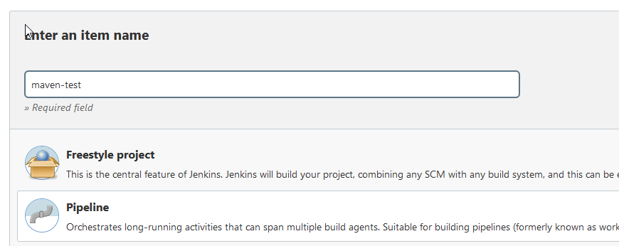
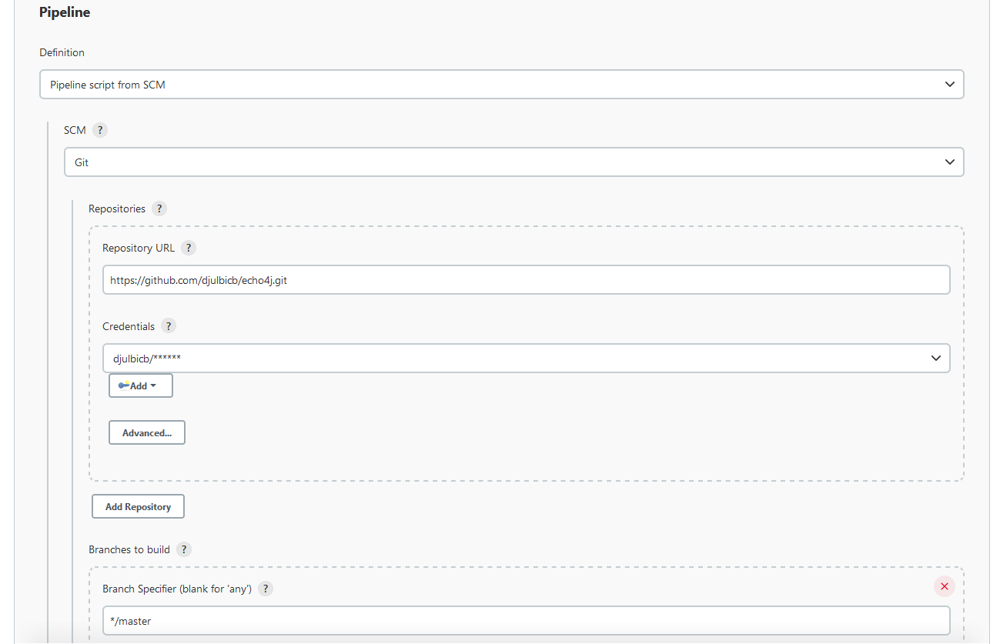

# Example: Basic Pipeline Job

## Startup jenkins and docker
```
apt update
apt install docker.io
docker run -p 8080:8080 -p 50000:50000 -d -v jenkins_home:/var/jenkins_home -v /var/run/docker.sock:/var/run/docker.sock -v $(which docker):/usr/bin/docker jenkins/jenkins
docker exec -it -u0 <hash> bash
chmod 666 /var/run/docker.sock
```
## Create job pipeline
1. Create new job


2. Connect jenkins to git

3. Add github and docker credentials to jenkins

4. Add Jenkinsfile and dockerfile to repo 

**Dockerfile**
```
FROM openjdk:8-jdk-alpine
EXPOSE 8080
ARG JAR_FILE=target/echo-0.0.1-SNAPSHOT.jar
ADD ${JAR_FILE} app.jar
ENTRYPOINT ["java","-jar","/app.jar"]
```
**Jenkinsfile**
```
pipeline {
  agent any
  
  tools {
    maven "maven-installation"
  }
  
  stages {
     stage("Build jar") {
      steps {
        script {
          echo "Building the application"
          sh "mvn clean package"
        }
      }
    }

    stage("Build image") {
        steps {
          script {
            echo "Building the docker image"
            withCredentials([ usernamePassword(credentialsId: 'docker-hub', passwordVariable: 'PASS', usernameVariable: 'USER')]) {
                              sh 'docker build -t djulb/echo4j:3.0 .'
                              sh "echo $PASS | docker login -u $USER --password-stdin"
                              sh 'docker push djulb/echo4j:3.0'
                          }
          }
       }
    }
      
  }
  
}
```

## Modify pipeline to use scripts
**Jenkinsfile**
```
def gv
pipeline {
    agent any
    
    tools {
        maven "maven-installation"
    }
    
    stages {
        stage("init") {
          steps {
            script {
              gv = load "script.groovy"
            }
          }
        }
        
        stage("Build jar") {
          steps {
            script {
               gv.buildJar()
            }
          }
        }
    
        stage("Build image") {
            steps {
              script {
                gv.buildImageAndPush()
              }
           }
        }
      
    }
}
```
**script.groovy**
```
def buildJar() {
    echo "Building the application"
    sh "mvn clean package"
}

def buildImageAndPush() {
    echo "Building the docker image"
    withCredentials([ usernamePassword(credentialsId: 'docker-hub', passwordVariable: 'PASS', usernameVariable: 'USER')]) {
                      sh 'docker build -t djulb/echo4j:3.0 .'
                      sh "echo $PASS | docker login -u $USER --password-stdin"
                      sh 'docker push djulb/echo4j:3.0'
                  }
}

```