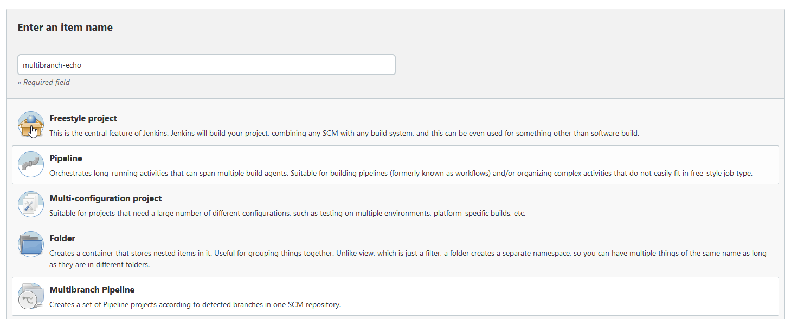
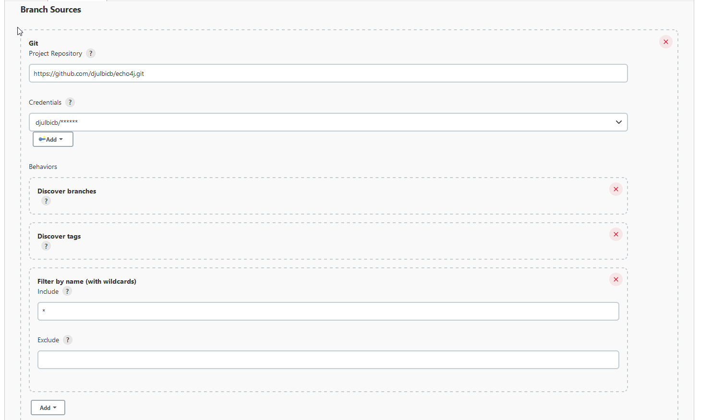
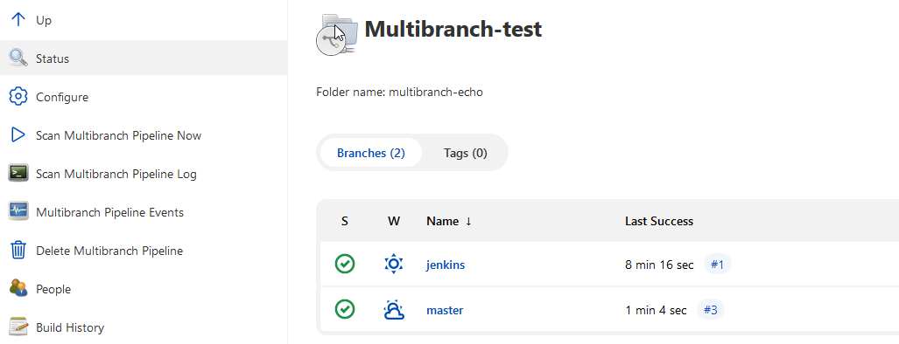
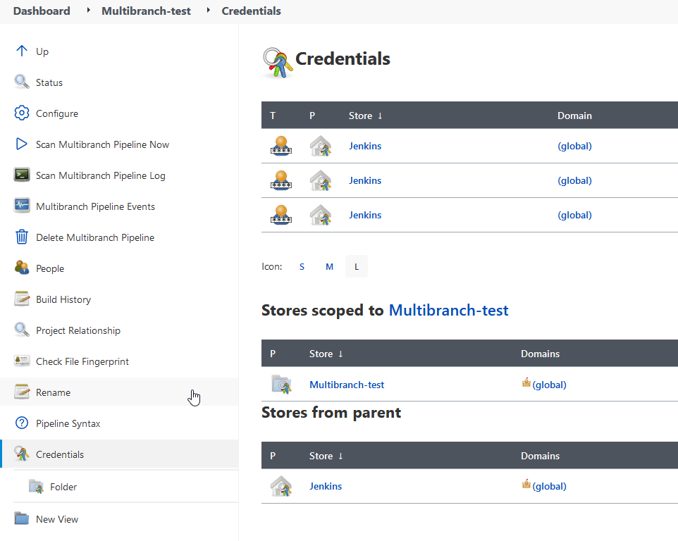

# Multibranch project
U git repo cesto imamo vise grana (master, dev, feature/, bugfix/...).
Obicno hocemo sve sve brancheve da testiramo ali ne i da se radi deploy za svaku granu.

Za git projekte sa vise grana, koristi se `Multibranch pipeline`

## Create multibranch project
1. make multibranch project
2. Branch sources: Add git source.
   1. Behavior: Discover branches, filter by name, regex: .*. Konkretnije cemo u Jenksinfile
   2. Jenkinsfile
   3. Save


**Configure project**
Izaberi Git a ne Github. Za behavior ostavi default discover brances i dodaj `Filter by name (with regular expression)`


Pokreni `Scan Multibranch Pipeline Now` i task ce kreirati Job za svaku granu. 



Na svakoj grani ovog projekta stoji Jenkinsfile, i ti fajlovi mogu biti razliciti medjusobno.

**Jenkinsfile**
```
pipeline {
  agent any
  tools {
    maven "maven-installation"
  }
  stages {
     stage("Init") {
      steps {
        script {
          echo "Testing the application"
          echo "Execute pipeline for ${BRANCH_NAME}"
        }
      }
    }

   stage("Build Master") {
      when {
        expression {
          BRANCH_NAME == "master"
        }
      }
      steps {
        echo "Running on master branch"
      }
    }

   stage("Build Jenkins") {
     when {
        expression {
          BRANCH_NAME == "jenkins"
        }
      }
      steps {
        echo "Running on jenkins branch"
      }
   }
    
  }
}
```

## Dodatno
- Od opcija, kada job padne imas opciju `Restart from stage` i kazes kog stage. Za situacije kad hoces da preskocis odredjeni stage.
- Tu je isto opcija `Redeploy` za hotswapovanje Jenkinsfile

# Credentials
Rad sa credentials je enabled preko credentials binding plugina. Credentials se cuvaju u Jenkins sotru. 
 
Postoje 3 credentials scope
1. System jenkins i to je moguce samo za jenkins server. Za admine, konfigurise jenksins i interfejs za servise. On nije vidljiv od strane jenkins joba.
2. Global je svima pristupacan. Ima razliciti tipovi, preko id rederenciras 
3. Multibranch credentials.

Idi na multibranch i postoji credentials dugme. Ovaj scope je multibranch pipeline.

Ovo je omoguceno zbog folder plugina. Svaki projekat ima svoj folder. 


