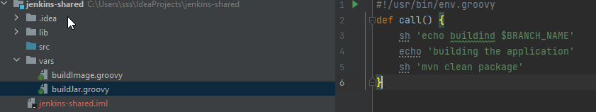
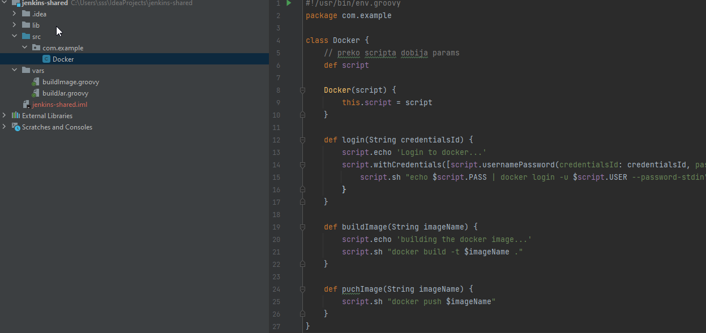
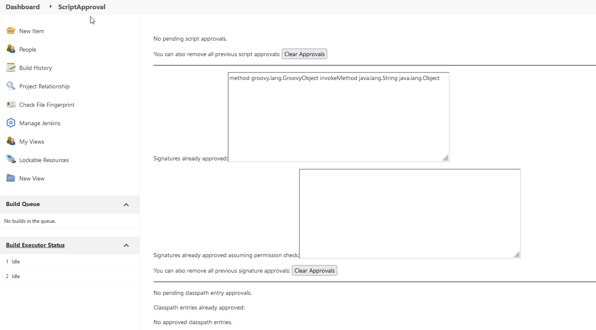

# Jenkins shared library
> `Dashobard>Rename` - renames existing multibranch project

Recimo da u produkciji imamo 10 java maven microservice projekata i da su sve deo jedne aplikacije.
Za svaki microservice trebace nam isti pipeline.

To znaci da ce vise projekata imati slicni Jenksinsfile, i da ce deliti 95% logike (ie nexus-repo, slack notifikacije).
Postojace jedna groovy biblioteka i njene funkcije ce se pozivaju u Jenkinsfajlu.

## Create Jenkins library
In intelij new Groovy Project: jenkins-shared. Projekat po defaultu ima main folder koji se zove vars i ima sve funkcije koje bismo pozvali u jenkins filu.

Bukvalno cemo da podelimo onaj fajl iz chaptera 3
Sve funkcije ces da referenciras na osnovu file imena

**Project folder structure**


> Za rad sa groovy fajlovima, da IDE prepozna syntax: #!/usr/bin/env.groovy

**vars/buildJar.groovy**
```
#!/usr/bin/env.groovy
def call() {
    sh 'echo buildind $BRANCH_NAME'
    echo 'building the application'
    sh 'mvn clean package'
}
```

**vars/buildImage.groovy**
```
#!/usr/bin/env.groovy
def call(String imageName) {
    echo "Building the docker image"
    withCredentials([ usernamePassword(credentialsId: 'docker-hub', passwordVariable: 'PASS', usernameVariable: 'USER')]) {
        sh "docker build -t djulb/echo4j:$imageName ."
        sh "echo $PASS | docker login -u $USER --password-stdin"
        sh "docker push djulb/echo4j:$imageName"
    }
}
```

After that push repo:
```
git init
git remote add origin git...
git add .
git commit -m "initial"
git push -u origin master
```

## Make Library available in jenkins file

> Dashboard > Manage Jenkins > Configure System > Global Pipeline Libraries > Create new library : shared-library (ne mora isto kao repo name)

**Default version**: je version ili commit hash ili tag. Dobro je da stavljas tag na verziju. Ovde napisi `master`

U projektu napravi novi branch `jenkins-shared-lib` 

**Jenkinsfile**

Deklaracija `@Library`, ako ispod njega ide direkt pipeline block mora da se odvoji ie. `@Library_`.
Ili ovde postoji deklaracija promenljive pa nije potrebno.

```
#!/usr/bin/env.groovy
@Library('name-of-shared-library')
def gv
pipeline {
    agent any
    tools {
        maven 'Maven'
    }
    stages {
        stage ("iniut") {
            steps {
                script {
                    gv = load "script.groovy"
                }
            }
        }
        stage ("build") {
            steps {
                script {
                    buildJarFunkcijaIzBiblioteke()
                }
            }
        }
    }
}
```
Posle ovoga `Scan multibranch pipeline now` da registruje novi branch.
   
# Using classes in shared library - Make params available in code

**Project structure**


**src/com/example/Docker**
```
#!/usr/bin/env.groovy
package com.example

class Docker {
    // preko scripta dobija params
    def script

    Docker(script) {
        this.script = script
    }

    def login(String credentialsId) {
        script.echo 'Login to docker...'
        script.withCredentials([script.usernamePassword(credentialsId: credentialsId, passwordVariable: "PASS", usernameVariable: "USER")]) {
            script.sh "echo $script.PASS | docker login -u $script.USER --password-stdin"
        }
    }

    def buildImage(String imageName) {
        script.echo 'building the docker image...'
        script.sh "docker build -t $imageName ."
    }

    def puchImage(String imageName) {
        script.sh "docker push $imageName"
    }
}
```
buildImage.groovy
```
#!/usr/bin/env.groovy
import com.example.Docker
def call(String credentialsId, String imageName) {
    def docker = new Docker(this)
    docker.login(credentialsId)
    docker.buildImage(imageName)
    docker.puchImage(imageName)
}
```

## Napomena
Delete global imported library. I umesto toga reference library directly in jenkinsfilu.
Tom prilikom kad koristis @Library anotaciju moras da kazes neki tag tipa verzija, branch...
```
library identifier: 'jenkins-bilo-koje-ime@master', retriever: modernSCM(
    [$class: 'GitSCMSource', remote: 'https://gitlab.com/boj.git', credentialsId: '']
)
@Library('jenkins-bilo-koje-ime@master')
```

Takodje ovo ce biti blokirano u Jenksins sandboxu. Pa mora da se dozvoli
> Dashboard > Manage Jenkins > In process script approval. Dozvoli ovo `method groovy.lang.GroovyObject invokeMethod java.lang.String java.lang.Object`
