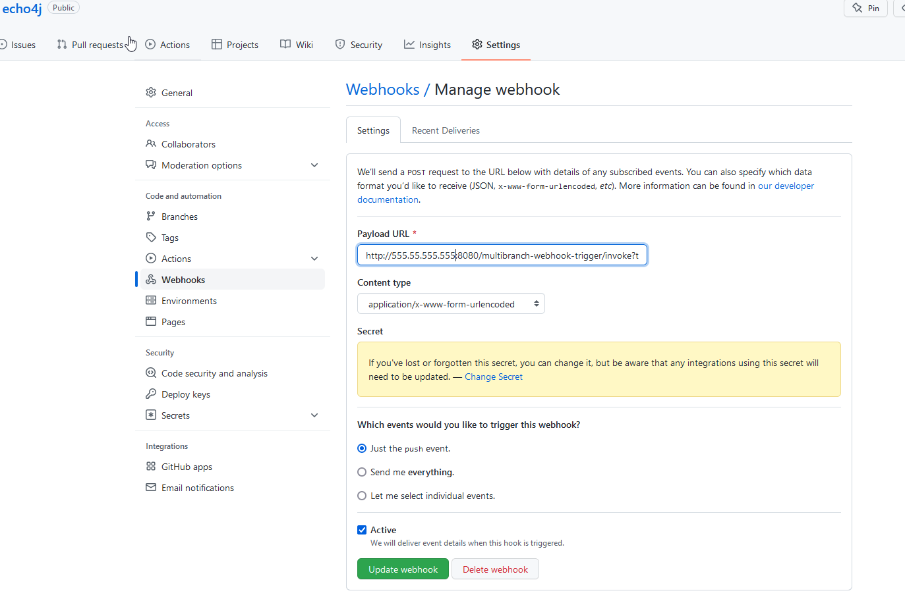

# Configure Jenkins and Github for webhook in multibranch project
Use plugin `Multibranch Scan Webhook Trigger Version 1.0.9`. Documentantion `https://plugins.jenkins.io/multibranch-scan-webhook-trigger/`.

## Set up on Jenkins
After installing plugin, define token name. This token is used in Github webhook as a trigger name

## Set it on Github
Url example: `http://555.55.555.555:8080/multibranch-webhook-trigger/invoke?token=token-name`

## Stop infitinite build loop when using webhooks
Install plugin `Ignore Committer Strategy Version 1.0.4`. Documentation: `https://plugins.jenkins.io/ignore-committer-strategy/`

In `Project > Configuration > Build sources > Add build strategy > Ignore Commiter strategy`. Add email of user to be ignored. This email is specified in Jenkinsfile when commiting back to git.

