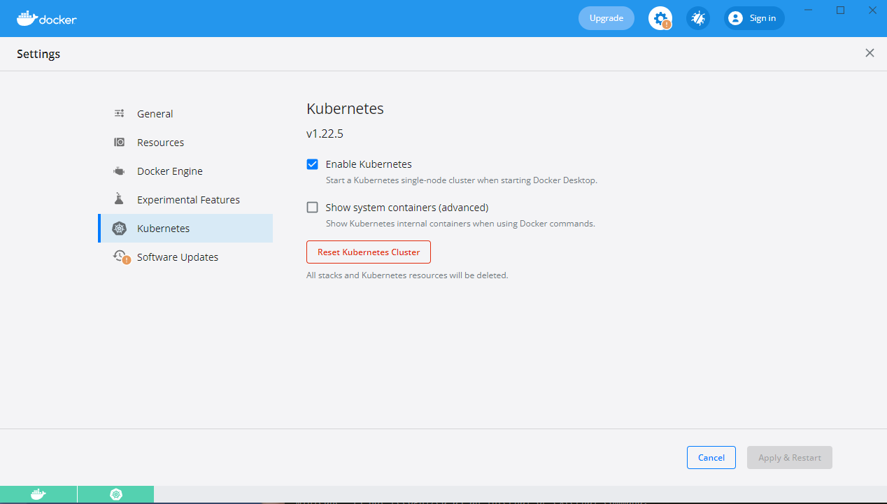

# Kubernetes
- Open source container orchestration tool build by Google.
- Helps you manage app with n... containers in virtual or physical environments.
- Microservice trend increased usage of containers
- These tools allow **high availability** (no downtime). **Scalability** (high performance), **disaster recovery** (backup, restore)

## Kubernetes components
1. **Node** - Worker node (Node) is a simple server (physical or virtual). Master node controls worker nods. You can have multiple master or worked nodes.
2. **Pod** - is abstraction of container. Smalles unit of K8s.
   - Pod is abstract layer over container. In this case you can use only this layer to communicate with pod.
   - Each pod gets its own IP address, and communicate with each other using this internal IP address.
   - Pods are ephemeral, they can die easily. With every pod restart, a new IP will be created.
Because of that a service is used and attached to each pod.

3. **Service** - has IP address and is connected to some pods. Service is used for communication. Service is also **load-balancer**.
4. **External Service** - Allows communication with external sources
5. **Internal Service** - For communicating from inside k8s network
6. **Ingress service** - Does forward of domain name to IP
7. **Config map** - for externalizing configurable properties
8. **Secrets** - same thins as config map, but encrypted. Usually you use 3rd party.
9. **Data storage** - If pod restarts, date is lost. We use volumes to prevent data lost.
   - **Volumes** - on local storage, or remote outsie of cluster. Volumes are outside of K8s Cluster.
     Volumes are external disk and k8s doesnt manage it.
10. **Deployment** - You dont work with pods directly. Deployment is abstraction of multiple pods. Allows pod replication.
11. **Stateful Set** - Deployment for databases. When you are using multiple databases you cannot use deployment cause it doesnt synchonize data. Then you use StatefulSet.
12. **Kubectl** - a command terminal client. Used for communicating between master process and ApiServer.
    There are different client apps (ui, app, cli) but kubectl is most powerful.

## Kubernetes processes
K8s install 3 process on every **worker node**. All these processes are controlled by **master node**
1. Container runtime (docker, cri-o, containerd(more lightweight))
2. Kubelet - k8s interface for communicating between pod and k8s. For example start pod
3. Kube Proxy - for forwarding requests

Master node has 4 processes
1. Api server - cluster gateway
2. Scheduler - Check pods on nodes, and depending on available resource it will create a new pod on free node. Scheduler contacts kubelets on nodes
3. Controller manager - Detect state changes, like pod crashing and tries to recreate k8s state by contanting schedualer.
4. etcd - key-value store. Its cluster brain. All mechanisms work based on data like what resources are available, or cluster change has changed.
    - This is just cluster state data. It doesnt contain application data.

# Minikube
In production you will have multiple master and worker nodes. For learning we can use minicube.

A minicube is single node cluster with one master and worker process. It works by using virtualBox.

## Install minicube
Minicube requres virtualization. So you need some Hypervisor.

https://minikube.sigs.k8s.io/docs/start/
minikube start
minikube ip

### Mac
```
brew update
brew install hyperkit
brew install minicube
kubectl
minicube

# Create minicube start cluster
minicube start --vm-driver=hyperkit

kubectl get nodes
kubectl version
# Ako vidis client mersion and master version, znaci da je minicube tu.
```

### Windows

