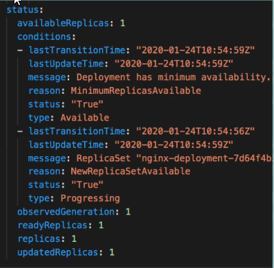

```
kubectl get pod
kubectl get services
kubectl get deployment
kubectl get replicaset
```

Usually you dont create pods directly, instead we create deployment.
ReplicaSet is in charge of number of replicas. ID of pods start by ID of replicaset.
```
kubectl create deployment name-of-depl --image=nginx
kubectl get deployment
kubectl get pod
kubectl get replicaset
```
Deployment manages a ReplicaSet. ReplicaSet manages Pods.

After running following command we get a file of its configuration which we can edit.
After editing old deployment is stopped and new one is created. Everything else below deployment is stopped and a new one is created.
```
kubectl edit deployment name-of-depl
# edit 
    spec:
      containers:
      - image: nginx:1.16
```
To check logs of pod. Nginx doesnt log anything
```
name-of-depl-59476f8d8f-wf259
```
Lets start mongo deployment for more logs
```
kubectl create deployment mongo-depl --image=mongo
kubectl logs mongo-depl-5fd6b7d4b4-qcldx
# to check status, state changes
kubectl describe pod mongo-depl-5fd6b7d4b4-qcldx
```
Enter a pod
```
kubectl exec -it mongo-depl-5fd6b7d4b4-qcldx -- bin/bash
exit
```
Delete deployment. ReplicaSet is automatically deleted.
```
kubectl delete deployment name-of-depl
kubectl delete deployment mongo-dep
```

# Kubernetes configuration files
You can create/update component using `apply` command. If specified deployment already exists, k8s will edit the current one.
**run**
```
touch config-file.yaml
kubectl apply -f config-file.yaml
```

**config-file.yaml**
```
apiVersion: apps/v1
kind: Deployment
metadata:
  name: nginx-deployment
  labels:
    app: nginx
spec:
  replicas: 2
  selector:
    matchLabels:
      app: nginx
  template:
    metadata:
      labels:
        app: nginx
    spec:
      containers:
        - name: nginx
          image: nginx:1.16
          ports:
            - containerPort: 8080
```

**config-file.yaml - Explanation**
Every config file has 3 parts
1. Metadata of the component that is created. ApiVersion, kind. metadata, spec
2. **spec** - has specificiation for new component that is specific to component
3. Status - k8s autogenerates. Basically new text block where it specifies count of replicas, last date... This data is stored in etcd. k8s compares status between desired and actual.


Where to store config files?: 
- This config files are usually stored with application code. To follow the `infrastructure as code` concept. 
- Or it can have its own repo. 

Template has its own metadata, spec blocks.
```
apiVersion: apps/v1
kind: Deployment
metadata:
  name: nginx-deployment
  labels:
    app: nginx <<< label. This label is used by service selector
spec:
  replicas: 2
  selector:
    matchLabels:
      app: nginx   <<< This is connectiong between deployment and pod. Connect with all pods that have this label
  template:
    metadata:
      labels:
        app: nginx <<< This is the label of the pods
    spec:
      containers:
        - name: nginx
          image: nginx:1.16
          ports:
            - containerPort: 8080
 ---
 apiVersion: v1
 kind: Service
 metadata:
    name: nginx-service <<< This will connect service to the deployment
 spec:
    selector: 
        app: nginx
    ports:
        - protocol: TCP
          port: 80
          targetPort: 8080
```

kubectl describe service service-name
output has endpoints, targetport. These IP addresses are endpoints of pods
What are the IP addresses of pods. With this command you will IP addresses 
kubecetl get pod -o wide 

# this will open config file from etcd
This file is edited and updated by k8s during runtime.
kubectl get deployment nginx-deployment-name -o yaml > nginx-deployment-result.yaml

kubectl delete -f nginx-deployment.yaml


