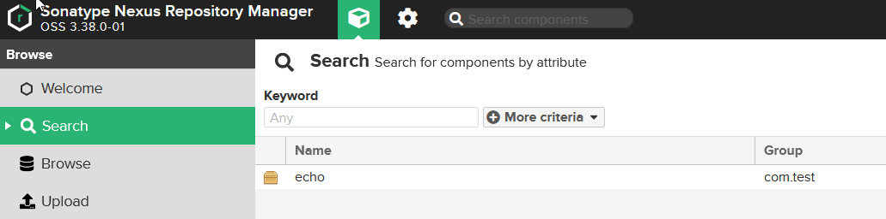

[61,62,63,64,65]

## Glossary:
### Artifact
Artifact is app built into a **single file**. Its shareable and easily moweable.
### Artifact repository
Is place where artifacts are stored and needs to support that specific format
### Artifact Repository Manager
Softwar which is able to produce different types of artifacts. Example of managers are Nexus or JFrog....
Here you can upload/store/download different build artifacts. Solves common problem of having too many artifact manager. Instead of having many, use only one.

# Install and start Nexus
Nexus is a repository manager which support open source and commercial project. Nexus can be private repo and also create proxy repository to a mavenrepo to consolidate repo managment. 

Examples of public managers are MavenRepository.

**Nexus supports:** 
- LDAP for user access. 
- Rest API for integration with other tools. When Jenkins builds artifact it needs to push to nexus and then deployed to server. 
- Back-up and restore.
- Cleanup policy - remove old artifacts older than ... automatically
- Support tokens as authentication for system users

# Deploy to nexus
1. Create better droplet
```
Get better droplet
- Ubuntu
- Shared 
- Regular Intel with SSD
- 40$
 ```

2. Download nexus jar
> https://help.sonatype.com/repomanager3/product-information/download

U taru postoje dva foldera nexus-3.38.0-01, i sonatype-work.
- **sonatype-work** - contains specifc workspace configura. This can be used for backup for configs if version is getting updated or something crashes.
- **nexus folder** - is the main one

```
ssh root@55.555.55.55
apt install openjdk-8-jre-headless 
cd /opt/
wget https://github.com/sonatype/nexus-public/archive/refs/tags/release-3.38.0-01.tar.gz
tar -zxvf release-3.38.0-01.tar.gz
cd nexus
```

3. Napravi novog usera

Retko kad se rucno pravi user. Obicno se importuje preko LDAP.

Services should not run with root user. Create nexus user for service. In next step add access to nexus folders to this new user. 
> nexus:nexus - this is nexus user and nexus group. Group is by default created when user is created
 ```
adduser nexus
# create passowrd

chown -R nexus:nexus nexus-folder
chown -R nexus:nexus sonatype-work
 ```

4. Pokretanje nexusa
 ```
# service should run as user nexus. In file uncomment line
vim nexus-folder/bin/nexus.rc
#run_as_user="nexus"

# start nexus
su - nexus
/opt/nexus-folder/bin/nexus start
 ```

Check nexus is running
```
ps aux | grep nexus
netstat -lnpt # at port 8081
```

5. Add to firewall
Add to firewall inbound rule 8081

6. Log in to account. Username is `admin`. Password is in file `/opt/sonatype-work/nexus/admin.password`
Crete new password, and disable for anonymus users

# Configure nexus
Nexus repository mogu biti proxy, public, host. 
- Proxy je maska za public repo.
- Hosted sluzi za company repo, Its primary location for artifacts

Snapshots are for testing, releases are actual releases.

Snapshots are uploaded to nexus. On browser panel you can search for. By default view is empty.


### 1. Create user and role** 
Create user
> Zupcanik > Security > User > Crete local user.

Create Role
> Zupcanik > Security > Roles - privilidges. Privilegije su admin i view. Izaberi view * `nx-repository-view-maven2-*-*`.

Assign role
> Assign role to user on user view.

### 2a. Configure maven **
Add credentials for the local nexus user in `.m2/settings.xml`

**.m2/settings.xml**
```
<?xml version="1.0" encoding="UTF-8"?>
<settings xmlns="http://maven.apache.org/SETTINGS/1.0.0"
          xmlns:xsi="http://www.w3.org/2001/XMLSchema-instance"
          xsi:schemaLocation="http://maven.apache.org/SETTINGS/1.0.0 http://maven.apache.org/xsd/settings-1.0.0.xsd">

        <servers>
            <server>
                <id>nexus-snapshots</id>
                <username>Lowe</username>
                <password>Lowe</password>
            </server>
        </servers>
</settings>
```

**pom.xml**
```
	<build>
		<pluginManagement>
			<plugins>
				<plugin>
					<groupId>org.apache.maven.plugins</groupId>
					<artifactId>maven-deploy-plugin</artifactId>
					<version>2.8.2</version>
				</plugin>
			</plugins>
		</pluginManagement>
		<plugins>
			<plugin>
				<groupId>org.springframework.boot</groupId>
				<artifactId>spring-boot-maven-plugin</artifactId>
			</plugin>

			<plugin>
				<groupId>org.sonatype.plugins</groupId>
				<artifactId>nexus-staging-maven-plugin</artifactId>
				<version>1.6.3</version>
				<extensions>true</extensions>
			</plugin>
			
		</plugins>
	</build>

	<distributionManagement>
		<snapshotRepository>
			<id>nexus-snapshots</id>
			<url>http://55.55.55.55:8081/repository/maven-snapshots/</url>
		</snapshotRepository>
	</distributionManagement>

```

3. Package and deploy
```
mvn package
mvn deploy
```

4. Snapshot can be seen on browser window


### 2b. Configure gradle ** 
Maven i gradle koriste isti format za upload

1. Create credentials `gradle.properties`
```
# create gradle properties file in root of project
repoUser = bojan
repoPassword = Lowe
```
2. gradle
**gradle.build**
```
apply plugin: 'maven-publish'
publishing {
    publications {
        maven(MavenPublication) {
            artifact("build/libs/my-app-$version"+".jar") {
                extension 'jar'
            }
        }
    }

    repository {
        maven {
            name 'nexus'
            url 'http://55.55.55.55:8081:/repository/maven-snapshots'
            credentials {
                username project.repoUser
                password project.repoPassword
            }
        }
    }
}

repository {
    mavenCentral()
}
```

**settings.gradle**
```
rootProject.name=my-app
```

3. Build
```
./gradlew build
./gradlew publish 
```

# View uploaded snapshot


# Use api to view nexus repo
Nexus ima api za pregled repo i components.

```
curl -u user:psw -X GET 'http://555.55.555.555:8081/service/rest/v1/repositories'
curl -u user:psw -X GET 'http://555.55.555.555:8081/service/rest/v1/repositories'
# for watching assets
curl -u user:psw -X GET 'http://555.55.555.555:8081/service/rest/v1/components/123456789id'
```