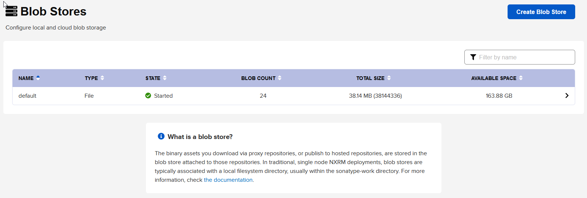

Nexus uses blob stores for storing web components. Blob stores is internal storage mechanism for binary files. 

# Blob store

Blob store cannot be modified after creating. So you should know how much space you gonna need, how many jars, how manny policies....

Blob store can be file based or cloud:s3

Blob store - state : [started|failed]
data is split into blobs. Count of blobs is defined by `blob count`.

Nexus has **default** blob store. Blob stores is located in `./sonatype-work/nexus3/blobs`.
In blob stores config there is a field for path ie. default. Data is stored in folder `content`.

When creating a repository you pick a blob store. This connection is permananent.

# Components and assets - what is difference
Component are abstract represantation or what we are uploading.
Component is any package that is uploaded to repo, ie. package, archive, jar... This is a general definition of packaged file.

Assets is actual package/file. 1 component has 1 or more assets

Docker gives unique identifier to assets. This is called docker layer
Docker layers == Assets
Multiple docker images can point to same layer, ie some image based on node, or debian...
