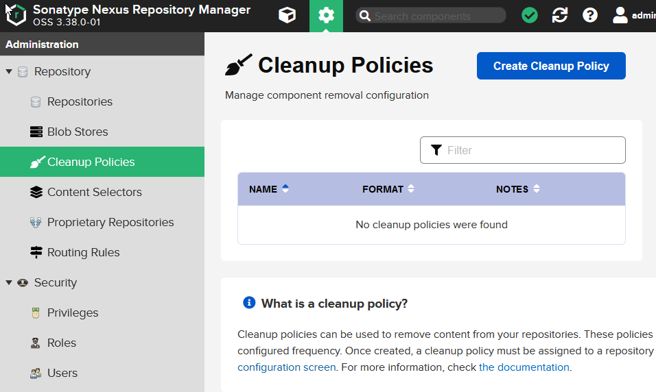
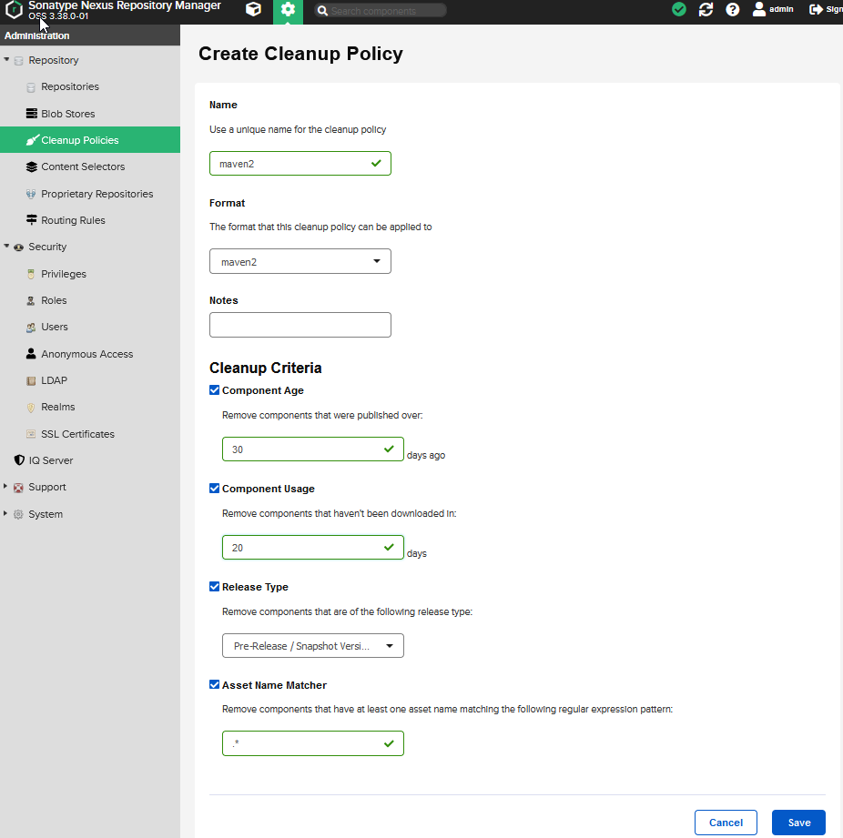
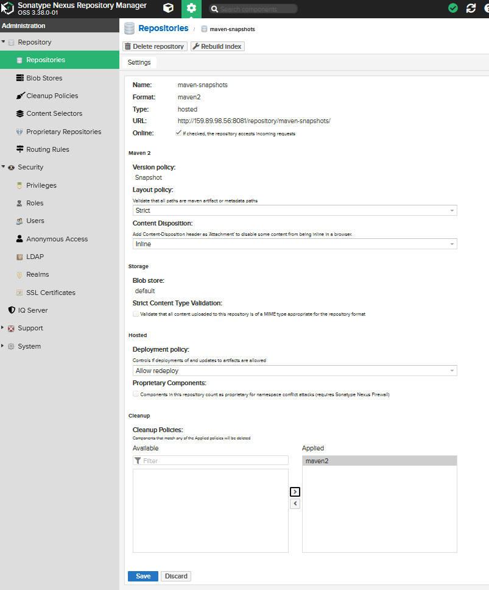
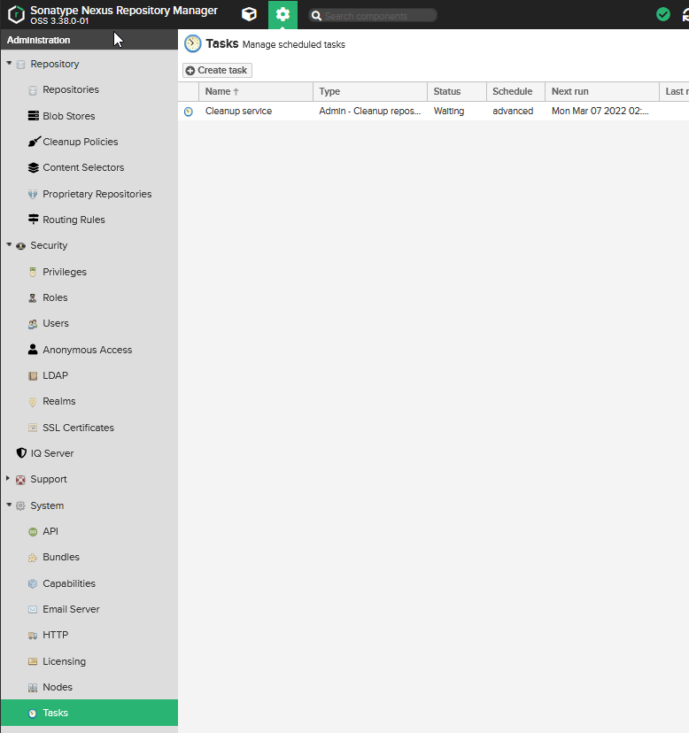
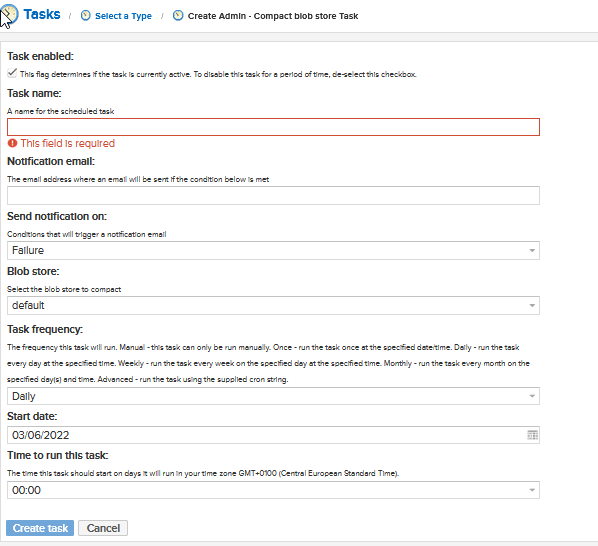

# Create cleanup policy

## Link policy to repository

## Task created

They will not actually be deleted. They are marked for deletion, this is called soft delete.
So we need to compact blob store task

