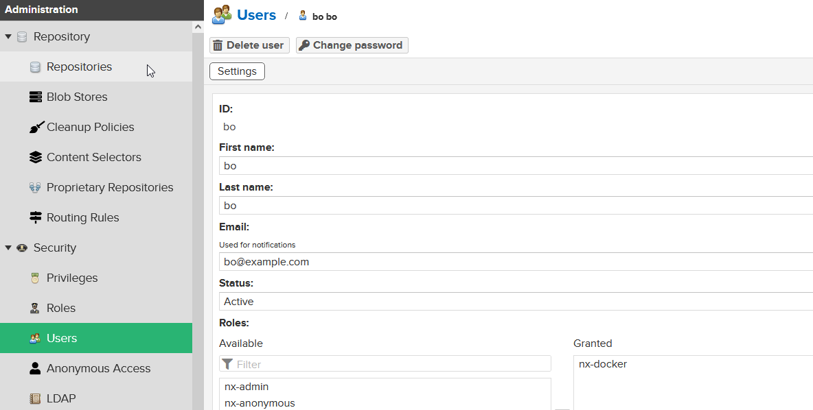

For this task i am using dockerized nexus. During startup expose docker port. Otherwise you cant login
```
docker run -d -p 8081:8081 -p 8083:8083 --name nexus -v nexus-data -e CONTEXT_PATH=/  sonatype/nexus3
```

# Using docker in dockerized Nexus

1. Login admin:admin
2. Create blob store `docker-blobs`
3. Create docker repo
```
Repository > select recipe > docker hosted
name: docker-my
store: docker-blobs
HTTP: 8083
```
4.Create a new role with access ti docker-hosted
```
Role: nx-docker
Privilidge: nx-repository-view-docker-docker-my-*
```


5. Create new user with new role 


6. Add access to docker

In repo docker-hosted edit HTTP to enable port on which docker will be available.
Nexus is on 8081. Enable HTTP and set port 8083.

Add 8083 to firewall. Now repo is accesable 


7. Add docker bearer token

Nexus>Realms>Activate Docker Bearer Token Realm.

Docker by default goes to https endpoint of docker registry. 
For this scenario we need to configure docker client to allow insecure registry.

**On Mac and linux** `/etc/docker/daemon.json`
```
{
    "insecure-registries" : ["myregistry.com:5000]
}
```

**On windows**

Docker desktop starts like virtual machine. Go to docker desktop in preferences, docker engine,
there is a json tab in json format
```
{
    "debug" : true,
    "experimental" : true,
    "insecure-registries" : ["555.55.222.555:8083]
}
```

8. Build echo app

**Dockerfile**
```
FROM openjdk:8-jdk-alpine
EXPOSE 8080
ARG JAR_FILE=target/echo-0.0.1-SNAPSHOT.jar
ADD ${JAR_FILE} app.jar
ENTRYPOINT ["java","-jar","/app.jar"]
```

9. Login to docker, and push image

After first docker login a file `home/.docker/config.json` is created. Token for access will be used in future. This is what docker realm allows.
Na windows je `C:\ProgramData\Docker\config\config.json`

**run**
```
docker login 555.55:8083

docker build -t echo .
# docker build -t my-image:1.0
docker tag my-image:1.0 555.55.555.555:8083/my-image:1.0

# Push image to repo
docker images | grep my-im
docker push 555.55.555.555:8083/my-image:1.0
```

10. Test docker api
```
curl -u bo:bo -X GET 'http://555.55.555.555:8081/service/rest/v1/components?repository=docker-my'
```


