# CI/CD
What is build automation? Default tasks are:
1. Build app locally
2. Login to Docker repos
3. set up test environment
4. execute tests = cant code
5. Build docker image
6. Pushed to nexus repo
7. Send notifications
8. ... and many more things

For automation dedicated server is created for these tasks. For example Jenskins could:

1. get code hosted on hitlab
2. build java app with gradle
3. build docker image
4. push to nexus
5. deploy to AWS EC2

One of the main build automation tools is Jenkins.

---
# Create droplet
```
Droplet: 20$
name: jenkins server
attach new firewall
port 22, custom 8080 (jenkins app)
```

# Adding Jenkins to droplet
Two ways of installing Jenkins on DigitalOcean
1. Install Jenkins directly on OS manually, download package, create user...
2. Run Jenksins as Docker container

## Installing docker and jenkins
Port 50000 is default port in which master jenkins and workers are communicating. In case if its jenkins claster (rare).
```
ssh root@555.55.555.555
apt update
apt install docker.io
docker
docker run -p 8080:8080 -p 50000:50000 -d -v jenkins_home:/var/jenkins_home jenkins/jenkins
```
### Create jenkins admin password
Get initial password. Logged user in docker is jenkins by default. Install recommended plugins.
```
docker exec -it <id> /bin/bash
cat /var/jenkins_home/secrets/initialAdminPassword
```

### Installing plugins
Depending on the application you want to run, Jenkins has to have specific tools configured ie. **maven** and **npm** has to be available.

There are 2 ways to set these tools.
1. With plugins
2. install tools using commands on server or container in this case.

They are simmilar but plugins has predefined fields for inputing variables. Its limited and code can be confusing cause instead of writing `mvn --version` you would write `--version`
Second option is pure command terminal. Write whatever you want.

#### Installing Plugins - Maven
>Jenkins > Manage Jenkins > Global Tool Configuration

Click on `Add maven`
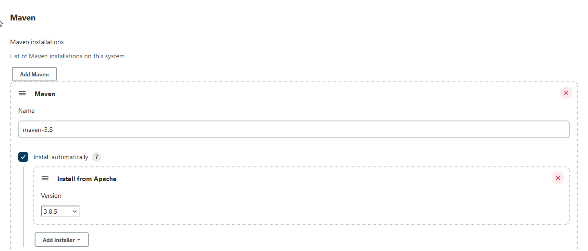

#### Installing Plugins - Install on server
By default when you login to jenkins docker you are logged in as jenkins user. It doesnt have permission to install. So first login as root user.

```
ssh root@555.55.555.555
docker exec -it -u 0 <hash>> bash
apt update
apt install nodejs npm
nodejs -v 
npm -v
```

#### Installing Plugins - Install NodeJs
First add Node node in Plugin Manager.
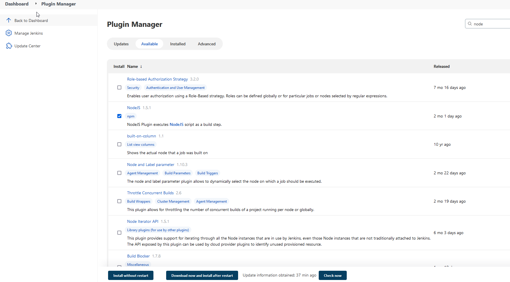
And then add installation in Global Tool Configuration.
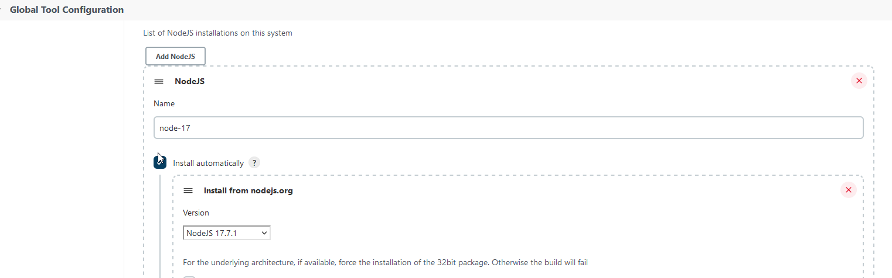
Now a new node option in build steps is available. Specify new node installation and add command.
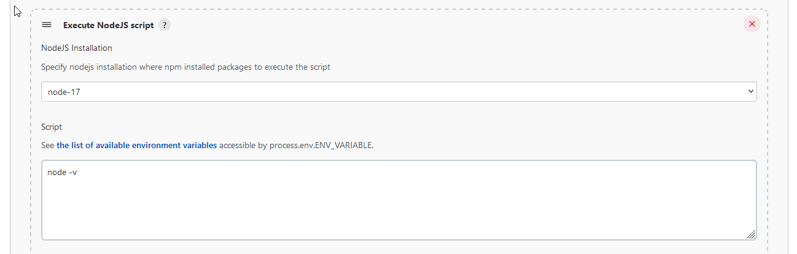

# Create simple job
> Dashboard> New Item

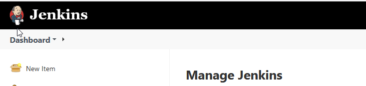

For first project we use **Freestyle project**. Freestyle project for simple project. Simpler and primitive than other.

Often in production we use **pipeline** and **multibranch pipeline**

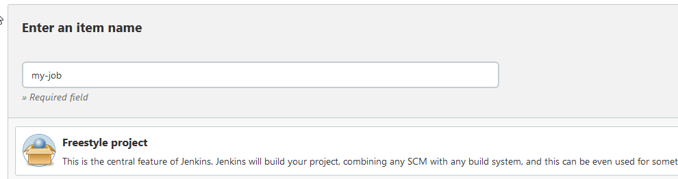

Create two build steps (**Invoke top-level Maven target**, **Execute shell**). When setting Maven, pick configured maven in dropdown menu.
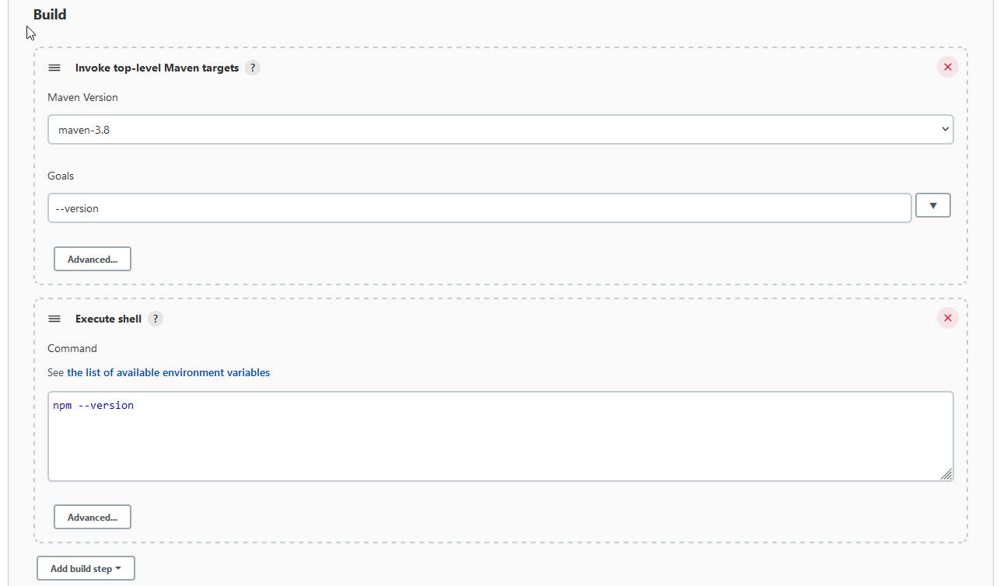

**Save** and run **Build now**.

Click on **build history**, **console**.

---

# Connect git with jenkins
Adding git repo is not required. Usually for git pipeline job is used. Freestyle project is used for some really specific tasks.

Create credentials (Username with password. Github credentials) and select it.

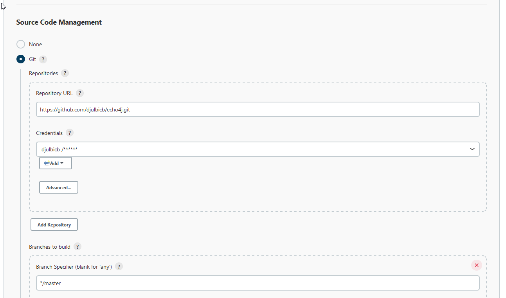

Run **Build now**. In console you can see repo is fetched.

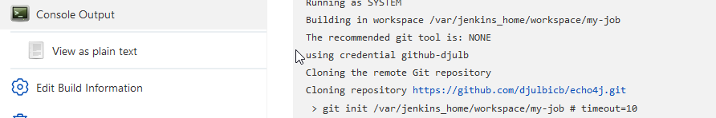

## View jenkins_home folder
```
ssh root@555.55.555.555
docker exec -it 676f185ad019 bash

# svi vazni podaci ovde
ls /var/jenkins_home/
cat /var/jenkins_home/credentials.xml

# Git projekat se ranije cuvao direkt u jenkins_home. Ali sad je u podfolderu workspace
/var/jenkins_home/workspace
```

# Create maven job

Dodale je primer ako u repo postoji fajl tipa `freestyle-build.sh`.
Nakon repo pulla, prvo chmod pa run
```
chmod +x freestyle-build.sh
./freestyle-build.sh
```
## Edit maven build step

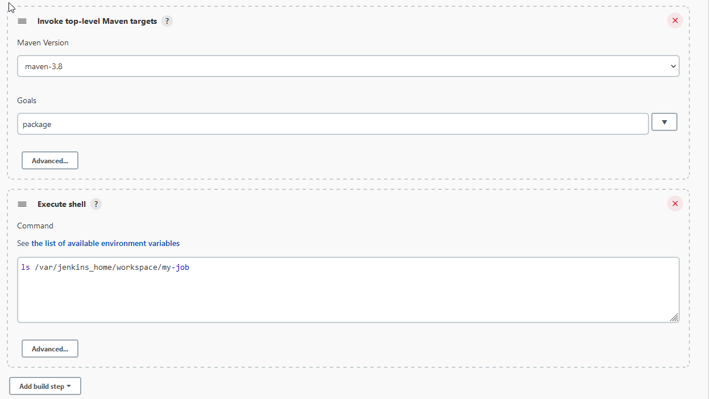
```
# after package a target file is create. My-job is the name of the job. 
package
ls /var/jenkins_home/workspace/my-job/target
```
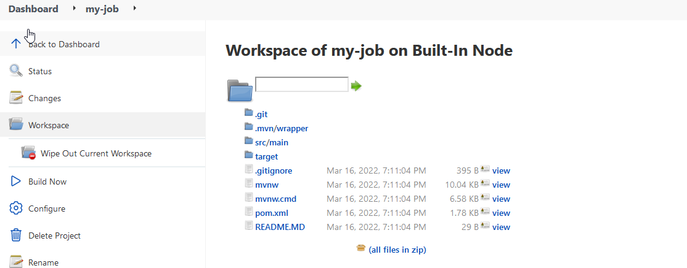

# Make Docker available in Jenkins 
First attach a volume for docker socket to jenkins container
```
docker run -p 8080:8080 -p 50000:50000 -d -v jenkins_home:/var/jenkins_home -v /var/run/docker.sock:/var/run/docker.sock -v $(which docker):/usr/bin/docker jenkins/jenkins
docker exec -u 0 -it <hash> bash
chmod 666 /var/run/docker.sock
docker exec -it <hash> bash
docker pull redis
# sad imas pristup
```

Kreiraj novi fajl sa rootom **/var/jenkins_home/workspace/my-job/Dockerfile**.
```
# u jenkins containeru
apt update
apt install nano

# Dockerfile
FROM openjdk:8-jre-alpine
EXPOSE 8080
COPY ./target/echo-0.0.1-SNAPSHOT.jar /usr/app/echo-0.0.1-SNAPSHOT.jar
WORKDIR /usr/app
ENTRYPOINT ["java", "-jar", "echo-0.0.1-SNAPSHOT.jar"]
```
Update job step

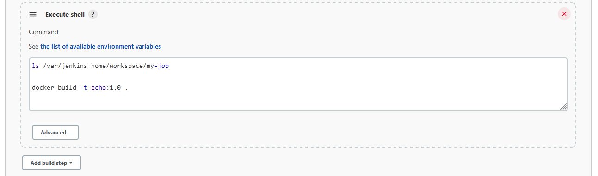

## Push docker image to Dockerhub

Add dockerhub credentials in job (Username and password separated). Enable first `Use secret text...` Define name of variables
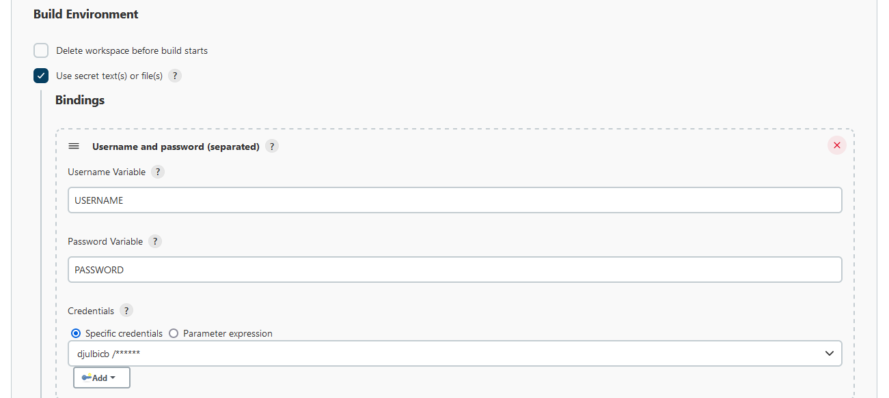

in maven job add docker login commands
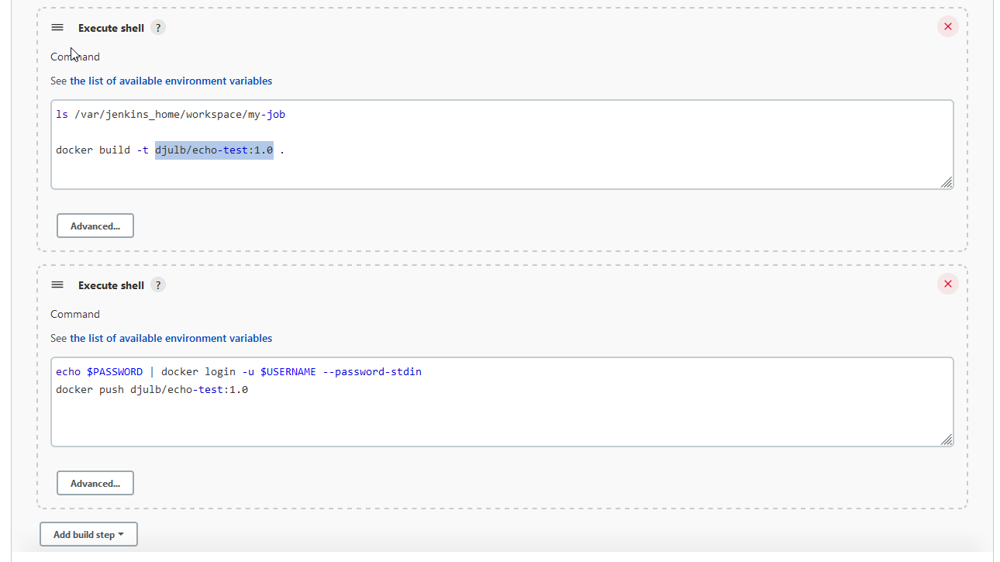

## Push docker image to Nexus Repository
Run nexus as container
```
docker volume create --name nexus-data
docker run -d -p 8081:8081 --name nexus -v nexus-data -e CONTEXT_PATH=/  sonatype/nexus3
```
Add Nexus docker-hosted repository to `/etc/docker/daemon.json` inside server
```
{
    "insecure-registries": ["165.232.73.83:8083"] 
}
```

Restart docker to apply this change. After restart reset permission for `/var/run/docker.sock`
```
systemctl restart docker
docker start <stopped jenkisn container>
docker exec -it -u 0 4b4 bash
chmod 666 /var/run/docker.sock
```

Edit maven command.
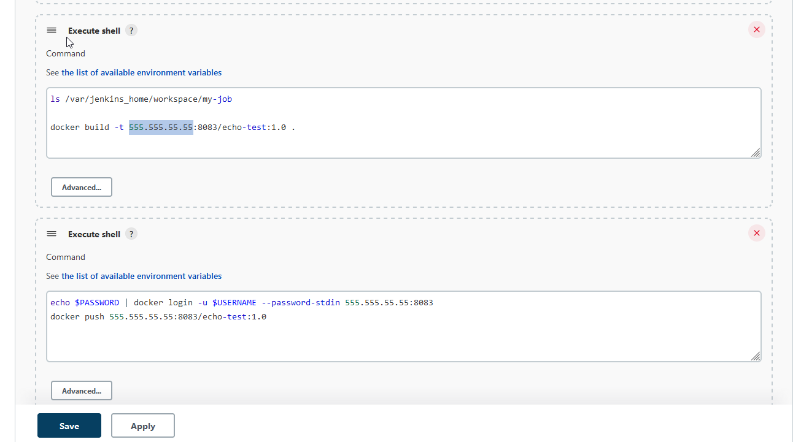

```
ls /var/jenkins_home/workspace/my-job
docker build -t 165.232.73.83:8083/echo-test:1.0 .

echo $PASSWORD | docker login -u $USERNAME --password-stdin 165.232.73.83:8083
docker push 165.232.73.83:8083/echo-test:1.0
```

# Why pipelines
Ovaj freestajl projekat radi vise koraka, package, build image, push. Ranije se svaki od ovakvih koraka definisao na novi job.

Pa nakon sto se jedan freestyle job zavrsi sledeci job se izvrsava. U delu Post-build Actions > Other project. Definise se ime joba koji ce sledeci da bude trigerovan.

Ovakav sistem je bio tezak za odrzvanje pa je zamenjen sa pipelinom.

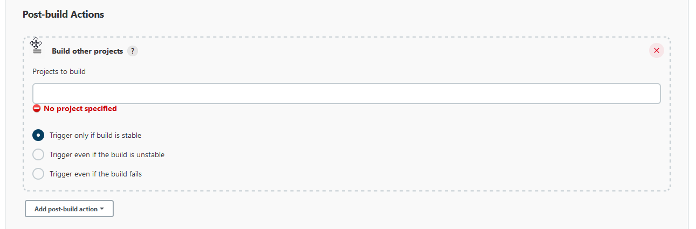