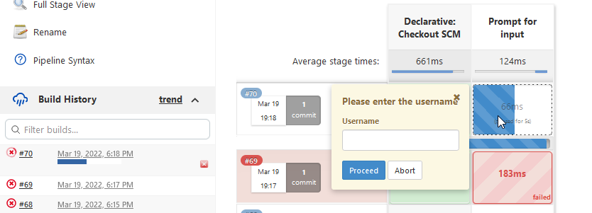

# Pipelines vs Freestyle
Frestyle workflow zasnovan je na UI. Ako je projekat kompleksan postaje tezak za odrzavanje.  
Tipa zahteva se input za verziju ili user input, postoji conditional. Plugini trebaju da se instaliraju u vise jobova, pa moraju da se odrzavaju.

Umesto freestyle u pipelinu se koristi groovy. Tu se mogu definisati promenljive, kreirati kondicionali, get user input. Generalno nema ogranicenja. 

Freestyle projekat je namenjen za single step. Za standardni devops workflow trebalo bi 7  freestyle jobova. Tako nesto je tesko za odrzavanje.

Pipeline workflow is superset of Freestyle workflow but simplified.

# Create pipeline

## Start jenkins
```
apt update
apt install docker.io
docker run -p 8080:8080 -p 50000:50000 -d -v jenkins_home:/var/jenkins_home -v /var/run/docker.sock:/var/run/docker.sock -v $(which docker):/usr/bin/docker jenkins/jenkins
```

## Create basic pipeline
Create pipeline
1. name: gittest type: pipeline

In pipeline section there are two options 
- pipeline script 
- from SCM, source management


Groovy sandbox opcija - dozvoljava da pokrenes skriptu bez dozvole admina, ali si ogranicen na whitelisted commande.

## Redeploy
**Redeploy** dozvoljava da hotswapujes Jenksinsfile i pokrenes ponovo. Redeploy takodje ima opciju generisanja template (textbox mora da je prazan).


## Create SCM pipeline
1. Pick option `Pipeline script from SCM`
2. Define GIT credentials, branch.
3. Make sure branch has Jenkinsfile


## Jenkinsfile syntax
Jenkinsfile moze biti
1. Scripted, no predefined structure
```
node {
    stage('Hello') {
        echo 'hello'
    }
}
```
2. Declarative
Declarative are a recent addition, not as much powerfull. 

- Agent any, next available agent, tipa na masteru ili slavu da se izvrsi.
- env vars are available. To see all of them `http://55.555.555.555:8080/env-vars.html`
- Stages of pipeline.

Var `BRANCH_NAME` is only available in multibranch pipeline.
```
pipeline {
    agent any

    stages {
        stage('Build') {
            when {
                expression {
                    JOB_NAME == "gittest"
                }
            }
            steps {
               sh 'ls'
               echo 'Building the applcation'
            }

            post {
                success {
                    echo 'Build was success'
                }
            }
        }
        stage('Testing') {
            when {
                expression {
                    JOB_NAME != "gittest"
                }
            }
            steps {
               echo "${JOB_NAME}"
               echo "${env.JOB_NAME}"
               echo '${env.JOB_NAME} - single quote stampa samo characters'
            }
        }
    }
    post {
        always {
            echo 'One way or another, I have finished'
        }
        success {
            echo 'I succeeded!'
        }
        unstable {
            echo 'I am unstable :/'
        }
        failure {
            echo 'I failed :('
        }
        changed {
            echo 'Things were different before...'
        }
    }
}
```
## Env vars in Jenkinsfile
Env vars can be defined in `environment{}` section
```
pipeline{
    agent any
    environment {
        NEW_VERSION='1.3.0'
    } 
    stages {
        stage("build") {
            steps {
                echo "building ${NEW_VERSION}"
            }
        }
    }
}
```

## Using groovy scripts and variables in Jenkinsfile

Jenkins podrzava groovy scirpt. Method calls on objects mogu da se izvrse samo u okviru **script{}** bloka

**Jenkinsfile**
```
def gv
pipeline {
    agent any

    stages {
        stage("init") {
            steps {
                script {
                    gv = load "testscripts.groovy"
                }
            }
        }
        stage("scripts") {
            steps {
                script {
                    def var = "sss";
                    gv.buildFunction()
                    gv.testFunction()
                    def branch = gv.getCurrentBranch()
                    echo branch
                }
            }
        }
    }
}
```

**testscripts.groovy**
```
def getCurrentBranch () {
    echo "Ovo ne vadi branch name kako treba, primer sa neta"
    return sh (
            script: 'git rev-parse --abbrev-ref HEAD',
            returnStdout: true
    ).trim()
}
def testFunction () {
    echo 'building the application'
    echo "deploy ${params.VERSION}"
}
def buildFunction () {
    echo 'building the application'
}
return this
```

## Credentials in Jenkins
Define credentials in Jenskins GUI and use in jenkisn file

> Jenkins Dashboard > Manage Credentials > click on bottom global > Add credentials


Define new credentials
```
id: bojan
kind: username with password
```
Postoji dva nacina koriscenja ovo: 
1. na celom Jenksinfile nivou
2. u okviru jednom stepa

### 1. Na nivou celog Jenkinsfile
Kredencijali ce se ucitati kao objekat.
```
def SERVER_CREDENTIALS=credentials('bojan')
pipeline {
    agent any
    stages {
        stage('Build') {
            steps {
                echo "deploying with ${SERVER_CREDENTIALS}"
            }
        }
    }
}
```

### 2. Samo u okviru jednog stepa
ako ce se koristiti u jednom koraku credentciali onda bolje samo tu
```
pipeline {
    agent any
    stages {
        stage('Build') {
            steps {
                withCredentials([usernamePassword(credentialsId: 'bojan', usernameVariable: 'USERNAME', passwordVariable: 'PASSWORD')]) {
                              sh 'echo $PASSWORD'
                              echo USERNAME
                              echo "username is $USERNAME"
                }

            }
        }
    }
}
```

# Tools
Po defaultu Jenkins dolazi sa Maven, Gradle, JDK. Svi ostali 
Jenkins needs to have build tools like mvn install commands in steps sh.
Dolazi sa maven gradle jdk. Tools have to be preinstalled in jenkins. Name of the installation
```
pipeline {
    agent any
    tools {
        maven 'some-maven'
    }
    stages {
        stage('Build') {
            steps {
                echo 'maven'
                sh 'mvn -version'
            }
        }
    }
}
```


# User inputs in steps

## Parameters
For adding user input parametre koristi se block `parameters{}`. 

Klikni `Build now` - Prvi put kad se ovo doda Jenkins nece registrovati i prvi build ce pasti.
Nakon toga updejtovace se UI i pisace `Build with parameters`.
```
pipeline {
    agent any
    parameters {
        string (name: 'VERSION', defaultValue: '10', description: 'version to deploy on prod')
        choice(name: 'CHOICE', choices: ['1.1.0', '1.1.1'], description: 'some choice')
        booleanParam(name: 'BOOL', defaultValue: true, description: 'some bool')
    }
    stages {
        stage('Condition') {
            when {
                expression {
                    BOOL == true
                }
            }
            steps {
                echo "Condition run"
            }
        }
        stage('Build') {
            steps {
                echo "Build run"
                echo "${VERSION} ${CHOICE} ${BOOL}"
            }
        }
    }
}
```


## User input during build

Add user input to steps. Izvrsavanje build se stopira dok ne kliknes na step i uneses input. 

Postoje dva nacina inputa:
1. preko `input()` bloka - kod mene ne radi, kaze da mi fali _message_ property
2. Preko input komande u samom koraku

```
pipeline {
  agent any
  stages {
    stage ("Prompt for input") {
      steps {
        script {
          env.USERNAME = input message: 'Please enter the username',
                             parameters: [string(defaultValue: '',
                                          description: '',
                                          name: 'Username')]
          env.PASSWORD = input message: 'Please enter the password',
                             parameters: [password(defaultValue: '',
                                          description: '',
                                          name: 'Password')]
        }
        echo "Username: ${env.USERNAME}"
        echo "Password: ${env.PASSWORD}"
      }
    }
  }
}
```

