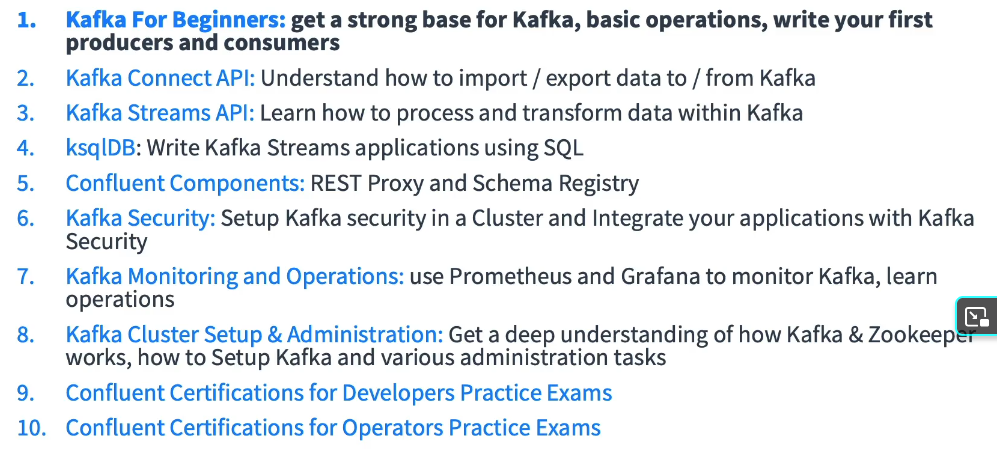
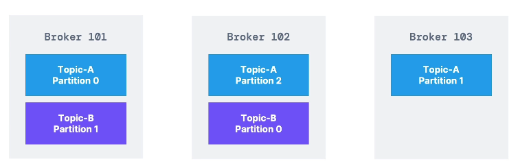

At start somebody will want to move one data from source to target.
But at some point there will be multiple targets, multiple protocols, data formats....

This problem is solved by decoupling using apache.

Data streams, are data streams in realtime

Stuff like:
- website events
- pricing data
- financial transactions
- user interactions
- messaging system
- activity tracking
- gather metrcis from different locations
- application logs gatherin
- stream procesing
- integration with spark, flink, storm, hadoop
- micro service pub/sub

Target systems are:
- database
- analytics
- email system
- audit

Netflix:
recommendations for tv
uber uses kafka to gather user, taxi, trip data in real time and compute, forecast demand. Surge pricing in real time
Linkedin to prevent spam, collect interactions to make connection recommendations

Kafka is transportation mechanism.

# Kafka topic
Topic is stream of data. Examples: logs, purchases, twitter_tweets, trucks_gps 

Similar to table in sql db without constraints.
Topic is identified by its name.
Sequence of messages is called data stream.

You cant query data in topics. You can only use Producers and Consumers.

Topic can be devided in partitions. Partition 0, 1, 2.
Messages in partitions have ordered index 1,2,3,4...n (offset).
Topic are append-read-only.

Trucks sends messages gps long, lat every seconds. It will send in trucks trucks_gps topic.
Topic has arbitraty 10 partitions.
Location is sent to location dashboard, and notification service.

Data is kept for a limited time, one week is default. Offset have meaning for partitions.
Offset 3 is present in all partitions. Offset keep increasing as you send messages they will never be rewritten.

Order is not guaranteed. Only guaranteed withing a partition, not across partitions.
By default message is randomly assigned to partition, can be specified.
Number of partitions per topic is not limited.

Producer >>> sends message. It will know in advance in whice partition it will send.
In case of kafka broker failure, producer will recover.

Topic-A/Partition 0
Topic-A/Partition 1
Topic-A/Partition 2

Message can be sent with a key (string, number...). If key=null it will round robin, 0,1,2...
Messages with same key, will always be saved to same partitions.

For example truck_id=123 will always send gps data to partition 0. So data will be ordered.
This is done by hashing.

Message has key-binary, value-binary, compression type none, gzip, snappy, lz4, zstd.
Headers in map form. Parition and Offset. Timestamp.
Then it will be sent to kafka broker.

Kafka only accept bytes. So when construct message
we need to transform data into bytes with Message Serializer.

Key: 123 >>> KeySerializer=IntegerSerializer >>> 01101101
Value: "hello world" >>> ValueSerializer >>> 010101011011010

Kafka producer come with common serializer. String, Int, Float, Avro, Protobuf.

Kafka partitioner will look at message and figure out in which partition to save.
Key hashing is to determine where to save by using murmur2 algorithm.
targetPartition = Math.abs(Utils.murmur(keyBytes)) % (numPartitions -1)

Consumer request data from brokers. By using poll model.

Consumer 1 reads from Topic-A/Partition 0. Consumer 2 reads from Topic-A/Partition 1 and 2.
Across parition 1 and 2 there is no guaranteed ordering. 

Consumer Deserializer. Consumer has to know in advance the format of message.
01010101 >>> KeyDeserializer, IntegerDeserializer >>> 123
01010101 >>> ValueDeserializer, StringDeserializer >>> "hello world"

Consumer has to know  in advance type of data.

If you need a new format, create a new topic and reprogram consumers.

# Consumer Groups
Multiple Consumers will read from partitions as a group

Consumer 1, 2, 3 in consumer-group-application.
Partitions 0, 1, 2, 3, 4, 5
Consumer will devide each other between partitions.
If there is uneven number of partitions and consumers, some consumers will be inactive.

From one topic there can be multiple consumers. For example notifications and log can read topic gps_trucks.

Consumer offsets - Last read offset for a consumer group. Stored in topic __consumer_offsets. __ are internal topics.
If consumer dies and comes back, it will know its last read offset.

Delivery semantics
- At least once - usually preferred - Java consumers will read at least once. Processing has to be idempotent.
- At most once - commit offsets as soon as read. But if something goes wrong, message will be lost
- Exactly once - using transactional API or idempotent consumer.

# Kafka Brokers
Cluster is group of brokers (servers). Each broker is identified with ID (integer).
Broker 101, Broker 102, Broker 103. Each brokers contains certain topics.
After doesnt need to know all brokers in cluster, just needs to know one.
After one of them is contacted (bootstrap broker) - you will be connected to cluster.

This allows horizontal scaling.


Each broker knows about all brokers, topics, and partitions (metadata).

When reading consumer needs to know any broker and topic. Kafka will redirect you to appropriate broker/partitions.
When saving producer chooses which broker to save to.

# Replication factor
Should be > 1, between 2 and 3. 
If broker is down another broker can serve the data.
Only one broker can be leader of giver partition.
Producers can only send data to broker that is leader of partition.
If replica is fast enough is ISR in-sync replica.

Since kafka v2.4 there is consumer replica fetching.
To configure consumer to read from closest replica and improve latency, network cost if in same cluster

# Producer Acknowledgements
Producer can wait for acknowledgment from leader broker
- acks=0 - Producer doesnt wait for acks, possible data loss
- acks=1 - Will wait for leader acks (Limited data loss)
- acks=all - Will wait for leader + replication

If replication factor of 3, topic durability can withstand 2 broker loss.
A rule is replication factor is N-1 brokers.

# Zookeeper
- manages brokers, keeps list
- Does leader elections
- sends notification of case changes like topic, broker dies, comes up, delete
- For 2.x zookeeper is mandatory
- For 3.0 you can use Kafka KRaft instead of zookeeper <<< This one
- For 4.0 No zookeeper. Its not production ready. Zookeeper is less secure from Kafka. Zookeeper should only allow broker access. Not consumers or producers.
- Zookeeper has scaling issues when more than > 100 000 partitions.
- By removing zookeeper can scale to millions. Faster shutdown and recovery

Zookeeper is designed to work with odd number of server 1, 3, 5, 7
Zookeper has a leader writes, and servers are followers reads.
Zookeeper used to save consumer offsets in Kafka < v0.10

Idea:
gradic sa dve stanice za bicikle
5 prodavnice hrane 
stanovi
kliknes na stan napravi narudzbinu
registracija koji bicikl da bude izabran
chaos monkey
average routes time


# Start up Kafka on Linux with Zookeeper
## Add kafka bins
```
Download kafka binaries
nano .bashrc.rc
~/Documents/dev/kafka_2.13-3.1.0/bin
source .bashrc.rc
kafka-topics.sh
```

## Start
If you install using apt, brew ... commands are kafka-topics.
If its installed via binaries then kafka-topics.sh
```
- these properties specify /tmp/ folder as data location
zookeeper-server-start.sh config/zookeeper.properties
kafka-server-start.sh config/server.properties
kafka-
```

# Start up Kafka on Linux with KRaft Mode (no zk)
Not production ready. Good for one broker
```
# generate uuid for cluster
kafka-storage.sh random-uuid
kafka-storage.sh format -t <uuid> -c config/kraft/server.properties
kafka-server-start.sh config/kraft/server.properties
```

# kafka-topics.sh
```
# connect to bootstrap server
kafka-topics --bootstrap-server localhost:9092 --list
kafka-topics --bootstrap-server localhost:9092 --create --topic first_topic
first_topic == first.topic

In earlier replication and partitions param were required. Now it has default
kafka-topics --bootstrap-server localhost:9092 --create --topic first_topic --partitions 3

kafka-topics.sh --bootstrap-server localhost:9092 --describe --topic first_topic

kafka-topics.sh --bootstrap-server localhost:9092 --describe

kafka-topics.sh --bootstrap-server localhost:9092 --delete --topic first_topic
```

# kafka-console-producer.sh
```
kafka-topics --bootstrap-server localhost:9092 --topic first_topic --partitions 3 --create
kafka-console-producer --bootstrap-server localhost:9092
message 1
message 2
CTRL+C

kafka-console-producer --bootstrap-server localhost:9092 --topic first_topic --producer-property acks=all
message 3

kafka-console-producer --bootstrap-server localhost:9092 --topic non-exisiting-topic
kafka will create a topic and define leader

kafka-topics --bootstrap-server localhost:9092 --describe new_topic

we are creating messages without keys, so messages are distributed on all partitions

# with keys
kakfa-console-producer --bootstrap-server localhost:9092 --topic first --property parse.key=true --property key.separator=:
example key:value
user_id_1234:Stephane
hello >>> Kafka Exception no key
```

# Kafka-console-consumer.sh
```
# by default reads at end, ignores before messages.
# write new message after starting 
kafka-console-consumer --bootstrap-server localhost:9092 --topic first_topic

kafka-console-consumer --bootstrap-server localhost:9092 --topic first_topic --from-beginning
# when you read it, messages will look its random. It actually in order withing partitions

# display key, values and timestamp in consumer
kafka-console-consumer --bootstrap-server localhost:9092 --topic first_topic --formatter kafka.tools.DefaultMessageFormatter --property print.timestamp=true --property print.key=true --property print.value=true --from-beginning
```

# Concumser groups
```
# have consumer and producer and topic withy 3 partitions. Only one consumer per parttition

# create two consumers with consumer group
kafka-console-producer --bootstrap-server localhost:9092 --topic first_topic --group my-group
message
it will go one consumer not the other one.

# create second consumer group, one consumer


# describe groups 
kafka-consumer-groups --bootstrap-server localhost:9092 --describe --group my-group
- shut down consumers
make consumer and 4 messages
and describe

kafka-consumer-groups --bootstrap-server localhost:9092 --list
kafka-consumer-groups --bootstrap-server localhost:9092 --describe --group consome-consumer-123

make new consumer without group and list it. it is emphemeral
kafka-consumer-groups --bootstrap-server localhost:9092 --list
```

# Reset offsets
```
kafka-consumer-groups --bootstrap-server localhost:9092 --list
kafka-consumer-groups --bootstrap-server localhost:9092 --describe --group my-group
kafka-consumer-groups --bootstrap-server localhost:9092 --group my-group --reset-offsets --to-earlist --execute --all-topics
kafka-console-consumer --boot local --topic first --group my_group
# reads all messages

kafka-consumer-groups --bootstrap-server localhost:9092 --group my-group --reset-offsets --shift-by -2 --execute --all-topics
```
