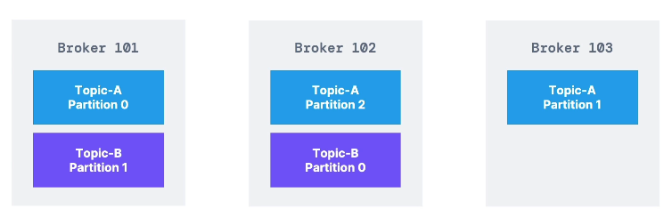

# Terms:

### Zookeeper
- manages brokers, keeps list
- Does leader elections
- sends notification of case changes like topic, broker dies, comes up, delete
- For 2.x zookeeper is mandatory
- For 3.0 you can use Kafka KRaft instead of zookeeper. Zookeeper is still recommended.
- For 4.0 No zookeeper. Zookeeper is less secure from Kafka. Zookeeper should only allow broker access. Not consumers or producers.
- Zookeeper has scaling issues when more than > 100 000 partitions.
- By removing zookeeper can scale to millions. Faster shutdown and recovery
- Zookeeper is designed to work with odd number of server 1, 3, 5, 7
- Zookeper has a leader writes, and servers are followers reads.
- Zookeeper used to save consumer offsets in Kafka < v0.10

# Kafka Cluster
Cluster is group of brokers (servers).
# Kafka Brokers
Each broker is identified with ID (integer). Example: Broker 101, Broker 102, Broker 103.

Each brokers contains certain topics. Consumer doesnt need to know all brokers in cluster, just needs to know one.
After one of them is contacted (bootstrap broker) - you will be connected to cluster.

This allows horizontal scaling.


Each broker knows about all brokers, topics, and partitions (metadata).

When reading, consumer needs to know at least one broker and topic. Kafka will redirect you to appropriate broker/partitions.
When saving producer chooses which broker/partition to save to.

### Topics
- Topics - named feed or category of messages. Ordered sequence (by time). Immutable events.
- Kafka uses architecture style - `event sourcing`. Data as events.
- Each message has timestamp, referencable identifier, and binary payload
- `Message Offset`: Each consumer has a bookmark of last read message. Offset is the message identifier.
- Different consumers have different offset positions. And they pick if stay, go back or go forward.
- Kafka doesn't have issue with slow consumers and message retention. Kafka retains all message within time period.
- Default retention period is 168 hours (7 days). It can be specified on per-topic.
- Broker wraps topics

# Kafka topic
Topic is stream of data. Examples: **logs, purchases, twitter_tweets, trucks_gps**. Similar to table in sql db without constraints.

Topic is identified by its name. Sequence of messages is called data stream. You can't query data in topics. You can only use Producers and Consumers.

Topic are append-read-only and divided in partitions. Partition 0, 1, 2.
Messages in partitions have ordered index 1,2,3,4...n (offset).

For example: Trucks sends messages GPS long, lat every seconds. It will send in trucks trucks_gps topic.
Location is sent to location dashboard, and notification service.

Data is kept for a limited time, one week is default. Offset have meaning for partitions.
Offset 3 is present in all partitions. Offset keep increasing as you send messages they will never be rewritten.

Order is not guaranteed. Only guaranteed withing a partition, not across partitions.
By default message is randomly assigned to partition, can be specified.
Number of partitions per topic is not limited.
 
Message can be sent with a key (string, number...). If key=null it will round robin, 0,1,2...
Messages with same key, will always be saved to same partitions. 

For example truck_id=123 will always send gps data to partition 0. So data will be ordered.
This is done by hashing.

Message has key-binary, value-binary, compression type none, gzip, snappy, lz4, zstd.
Headers in map form, contains Partition and Offset, Timestamp. Then it will be sent to kafka broker.

Kafka only accept bytes. So when construct message we need to transform data into bytes with Message Serializer. 

Kafka Producer comes with common serializer. String, Int, Float, Avro, Protobuf.
Consumer has to specify in advance deserializer.

```
# Serializer
Key: 123 >>> KeySerializer=IntegerSerializer >>> 01101101
Value: "hello world" >>> ValueSerializer >>> 010101011011010

# Deserializer
01010101 >>> KeyDeserializer, IntegerDeserializer >>> 123
01010101 >>> ValueDeserializer, StringDeserializer >>> "hello world"
```

Key hashing determines where to save by using murmur2 algorithm.
```
targetPartition = Math.abs(Utils.murmur(keyBytes)) % (numPartitions -1)
```

Consumer requests data from brokers by using poll model. Consumers read specific partitions.
For example Consumer 1 reads from Topic-A/Partition 0. Consumer 2 reads from Topic-A/Partition 1 and 2.
Across partition 1 and 2 there is no guaranteed ordering.

Consumer has to know  in advance type of data. If you need a new format, create a new topic and reprogram consumers.

# Consumer Groups
Multiple Consumers will read from partitions as a group.

```
# situation
Consumer 1, 2, 3 in `consumer-group-application`. 
Partitions 0, 1, 2, 3, 4, 5
```

Consumer will be assigned between partitions. 
If off number of partitions and consumers, some consumers are inactive.

From one topic there can be multiple consumers. For example notifications and log can read topic gps_trucks.

**Consumer offsets** - Last read offset for a consumer group. 
They are stored in topic `__consumer_offsets` (__ are internal topics).
If consumer dies and comes back, it will know its last read offset.

Delivery semantics
- **At least once** - usually preferred - Java consumers will read at least once. Processing has to be idempotent.
- **At most once** - commit offsets as soon as read. But if something goes wrong, message will be lost
- **Exactly once** - using transactional API or idempotent consumer.

# Replication factor
Should be > 1, between 2 and 3.
If broker is down another broker can serve the data.
Only one broker can be leader of giver partition.
Producers can only send data to broker that is leader of partition.
If replica is fast enough is ISR in-sync replica.

# Consumer Replica fetching - 
### !incomplete
Since kafka v2.4 there is consumer replica fetching.
To configure consumer to read from closest replica and improve latency, network cost if in same cluster

Works well with aws. Which rack.id. Rack of awz is az id. `rack.id=usw2-az1`
```
replica.selector.class= RackAwareReplicaSElector
client.rack
```

# Producer Acknowledgements
Producer can wait for acknowledgment from leader broker
- **acks=0** - Producer doesnt wait for acks, possible data loss
- **acks=1** - Will wait for leader acks (Limited data loss)
- **acks=all** - Will wait for leader + replication

If replication factor of 3, topic durability can withstand 2 broker loss. A rule is replication factor is N-1 brokers.

# Reset offsets
Ako hoces offsete da osvezis. Prvo consumere da se zaustave, pa osveze preko console, pa pokrenu ponovo


- heartbeat.interval.ms - Heartbeat should be 1/3 of session.timeout now 45s
- max.poll.interval.ms - default 5mins, time between to polls, before considered dead
- max.pool.records def500 - how many records per request
- fetch.min.bytes   1 - how many bytes for pull
- fetch.max.wait.ms - koliko dugo da ceka da se min bytes popuni

- max.partition.fetch.bytes - maximum abount of data from partition to return
- fetch.max.bytes - maximum data per fetch request


