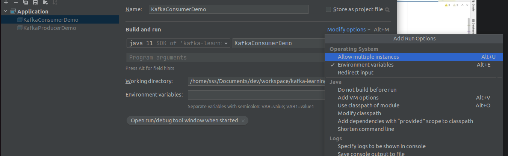

# Kafka Producer - Java
**console**
```
zookeeper-server-start.sh config/zookeeper.properties 
kafka-server-start.sh config/server.properties
kafka-topics.sh --bootstrap-server localhost:9092 --create --topic demo_java --partitions 3 --replication-factor 1
kafka-console-consumer.sh --bootstrap-server localhost:9092 --topic demo_java
```
**pom.xml**
```
<dependencies>
    <dependency>
        <groupId>org.apache.kafka</groupId>
        <artifactId>kafka-clients</artifactId>
        <version>3.1.0</version>
    </dependency>

    <dependency>
        <groupId>org.slf4j</groupId>
        <artifactId>slf4j-api</artifactId>
        <version>2.0.0-alpha7</version>
    </dependency>

    <dependency>
        <groupId>org.slf4j</groupId>
        <artifactId>slf4j-simple</artifactId>
        <version>2.0.0-alpha7</version>
    </dependency>
</dependencies>
```

**KafkaProducer.java**
```
import org.apache.kafka.clients.producer.KafkaProducer;
import org.apache.kafka.clients.producer.ProducerConfig;
import org.apache.kafka.clients.producer.ProducerRecord;
import org.apache.kafka.common.serialization.StringSerializer;
import org.slf4j.Logger;
import org.slf4j.LoggerFactory;

import java.util.Properties;

public class KafkaDemoApplication {
	private static final Logger log = LoggerFactory.getLogger(KafkaDemoApplication.class.getSimpleName());

	public static void main(String[] args) {
		// create Producer properties
		Properties properties = new Properties();
		properties.setProperty("bootstrap.servers", "127.0.0.1:9092");
		properties.setProperty(ProducerConfig.BOOTSTRAP_SERVERS_CONFIG, "127.0.0.1:9092");

		properties.setProperty(ProducerConfig.KEY_SERIALIZER_CLASS_CONFIG, StringSerializer.class.getName());
		properties.setProperty(ProducerConfig.VALUE_SERIALIZER_CLASS_CONFIG, StringSerializer.class.getName());

		// Create the producer
		KafkaProducer producer = new KafkaProducer<String, String>(properties);

		// create a producer record
		ProducerRecord<String, String> record = new ProducerRecord<>("demo_java", "hello world");

		// send data - async
		producer.send(record);

		// force send - sync. Cause if it shuts down, it may not be sent
		producer.flush(); // close also does flush
		producer.close();
	}
}
```

## Sticky partitioning
If multiple messages are sent in short time period, all of them will be sent to same partition. Instead round robin
```
// Create the producer
KafkaProducer producer = new KafkaProducer<String, String>(properties);

for (int i = 0; i < 10; i++) {
    // create a producer record
    ProducerRecord<String, String> record = new ProducerRecord<>("demo_java", "hello " + i );

    // send data - async
    producer.send(record, new Callback() {
        @Override
        public void onCompletion(RecordMetadata timestamp, Exception e) {
            // executes every time record is success or exception
            if (e == null) {log.info(String.format("Success --- topic:%s partition: %s offset: %s Timestamp: %s ", timestamp.topic(), timestamp.partition(), timestamp.offset(), timestamp.timestamp()));
                
                // INFO KafkaDemoApplication - Success --- topic:demo_java partition: 1 offset: 1 Timestamp: 1651510820630
            }
        }
    });
}

// If you want to force round robin behavior. Add sleep
try {
    Thread.sleep(1000);
} catch (Exception e) {

}

// force send - sync. Cause if it shuts down, it may not be sent
producer.flush(); // close also does flush
producer.close();
```

# Send messages with keys
Data will always go to same partition.
```
KafkaProducer producer = new KafkaProducer<String, String>(properties);
Random rnd = new Random();
for (int i = 0; i < 10; i++) {
    String topic = "demo_java";
    String key = "key" + i;
    String value = String.format("Key: %s, Value: %s", key, rnd.nextInt(10));

    // create a producer record
    ProducerRecord<String, String> record = new ProducerRecord<>(topic, key, value);

    // send data - async
    producer.send(record, new Callback() {
        @Override
        public void onCompletion(RecordMetadata record, Exception e) {
            // executes every time record is success or exception
            if (e == null) {
                log.info(String.format("Success --- topic:%s key:%s partition: %s offset: %s Timestamp: %s ", record.topic(), key, record.partition(), record.offset(), record.timestamp()));
                // INFO KafkaDemoApplication - Success --- topic:demo_java partition: 1 offset: 1 Timestamp: 1651510820630
            }
        }
    });
}

// force send - sync. Cause if it shuts down, it may not be sent
producer.flush(); // close also does flush
producer.close();
```

# Kafka consumer - Java
```
import org.apache.kafka.clients.consumer.ConsumerConfig;
import org.apache.kafka.clients.consumer.ConsumerRecord;
import org.apache.kafka.clients.consumer.ConsumerRecords;
import org.apache.kafka.clients.consumer.KafkaConsumer;
import org.apache.kafka.common.serialization.StringDeserializer;
import org.slf4j.Logger;
import org.slf4j.LoggerFactory;

import java.time.Duration;
import java.util.Collections;
import java.util.Properties;

public class KafkaConsumerDemo {
    private static final Logger log = LoggerFactory.getLogger(KafkaConsumerDemo.class.getSimpleName());

    public static void main(String[] args) {
        String bootstrapServer = "127.0.0.1:9092";
        String groupId = "my-app";
        String topic = "demo_java";

        Properties properties = new Properties();
        properties.setProperty(ConsumerConfig.BOOTSTRAP_SERVERS_CONFIG, bootstrapServer);
        properties.setProperty(ConsumerConfig.KEY_DESERIALIZER_CLASS_CONFIG, StringDeserializer.class.getName());
        properties.setProperty(ConsumerConfig.VALUE_DESERIALIZER_CLASS_CONFIG, StringDeserializer.class.getName());
        properties.setProperty(ConsumerConfig.GROUP_ID_CONFIG, groupId);
        // none - if no previous offsets found dont even start
        // earliest - Read from beginning of topic
        // latest - Read from now, latest topic
        properties.setProperty(ConsumerConfig.AUTO_OFFSET_RESET_CONFIG, "earliest");

        // create consumer
        KafkaConsumer<String, String> consumer = new KafkaConsumer<>(properties);

        // subscribe consumer to topic
        consumer.subscribe(Collections.singleton(topic));;

        // poll for new data
        while (true) {
            log.info("Polling...");
            ConsumerRecords<String, String> records = consumer.poll(Duration.ofMillis(100));

            for (ConsumerRecord<String, String> rec : records) {
                log.info(String.format("Key:%s, Value:%s, Partition:%s, Offset:%s", rec.key(), rec.value(), rec.partition(), rec.offset()));
            }
        }
    }
}
```

## Kafka consumer - with gracefull close
```
public class KafkaConsumerDemo {
    private static final Logger log = LoggerFactory.getLogger(KafkaConsumerDemo.class.getSimpleName());

    public static void main(String[] args) {
        String bootstrapServer = "127.0.0.1:9092";
        String groupId = "my-app";
        String topic = "demo_java";

        Properties properties = new Properties();
        properties.setProperty(ConsumerConfig.BOOTSTRAP_SERVERS_CONFIG, bootstrapServer);
        properties.setProperty(ConsumerConfig.KEY_DESERIALIZER_CLASS_CONFIG, StringDeserializer.class.getName());
        properties.setProperty(ConsumerConfig.VALUE_DESERIALIZER_CLASS_CONFIG, StringDeserializer.class.getName());
        properties.setProperty(ConsumerConfig.GROUP_ID_CONFIG, groupId);
        // none - if no previous offsets found dont even start
        // earliest - Read from beginning of topic
        // latest - Read from now, latest topic
        properties.setProperty(ConsumerConfig.AUTO_OFFSET_RESET_CONFIG, "earliest");

        // create consumer
        KafkaConsumer<String, String> consumer = new KafkaConsumer<>(properties);

        // adding the shutdown hook
        final Thread mainThread = Thread.currentThread();
        Runtime.getRuntime().addShutdownHook(new Thread() {
            @Override
            public void run() {
                // it will throw exception and leave while loop
                log.info("Detected a shutdown, lets exit by calling consumer.wakeup()");
                consumer.wakeup();
                try {
                    mainThread.join();
                } catch (InterruptedException e) {
                    e.printStackTrace();
                }
            }
        });

       try {
           // subscribe consumer to topic
           consumer.subscribe(Collections.singleton(topic));;

           // poll for new data
           while (true) {
               log.info("Polling...");
               ConsumerRecords<String, String> records = consumer.poll(Duration.ofMillis(100));

               for (ConsumerRecord<String, String> rec : records) {
                   log.info(String.format("Key:%s, Value:%s, Partition:%s, Offset:%s", rec.key(), rec.value(), rec.partition(), rec.offset()));
               }
           }
       } catch (WakeupException e) {
           log.info("Wake up exception");
           // this is expected exception when closin consumer
       } catch (Exception e) {
           log.error("Unexpected exception");
       } finally {
           consumer.close(); // this will commit offsets
       }
    }
}
```

**Starting uo multiple instances of app**


When partitions leaves/rejoins/add to group, a group is rebalanced.

Kafka has incremental rebalance, so it will assign and remove partition assigment gradually.
`partition.assigment.strategy`
- RangeAssignor
- RoundRobin
- StickyAssignor

StaticGroupMembership - member gets a static id, and if it comes back it will get back old id and it will be reassigned to consumer without rebalance.
session.timeout.ms specifies time of rebalance. Helpful with k8s.
```
properties.setProperty(ConsumerConfig.PARTITION_ASSIGNMENT_STRATEGY_CONFIG, CooperativeStickyAssignor.class.getName());
```

# Auto offset
```
auto.commit.interval.ms=5000
enable.auto.commit=true
```
Consumer does poll. Reads messages, poll again, read messages, poll again.
Behind the sync there is commitAsync and offset are commited behind the scene every 5s messages.


# Producer configs
## Producer acknowledgements

- **acks=0** : Producer doesnt wait for acknowledgment from broker (possible data loss)
  The producer considers messages succesfully sent the moment they are sent. This is useful with metrics collection.
- **acks=1** : Producer will wait for leader acknowledgment from broker leader (limited data loss)
  Producer considers message successfully sent when broker leader acknowledges. No guarantee of data replication. If broker goes offline replicas may loose this. If ack not received producer may retry request. Used to be default.
- **acks=all acks=-1** : Waits for leader replicas acknowledgment (no data loss). Default in kafka 3.0
  Written successfully when broker and ISR acks.

Acks is used in combo with `min.insync.replicas`.
- **min.insync.replicas=1** : Only broker leader needs to ack
- **min.insync.replicas=2** : Broker leader + Replica needs to ack

Recommended properties (loss of one broker is acceptable.):
```
partitions=3. 
replica factor=2. 
min.insync.replicas=2. 
acks=all. 
```

## Producer retries
In case of transport failure ie. NOT_ENOUGH_REPLICAS there is retries settings.
```
retry.backoff.ms=100ms
delivery.timeout.ms=120000 == 2min
```

#### For older kafka
If you are not using Idempotent producer in case of retries there is a change messages are sent out of oder.
Also If you rely on key-based ordering.

In that case set `max.in.flight.requests.per.connection=1` to ensure ordering

In newer kafka idempotent producer

# Idempotent producer
They are default in kafka 3.0. Setting are
- retries=Integer.Integer.MAX_VALUE
- max.in.fligh.requests=5
- acks=all
- producerProps.put("enable.idempotence, true);

Kafka v <=2.8 doesn't use idempotence. You have to fake it
- acks=all : data is replicated and ack
- min.insync.prelicas=2 : 2 brokers need to ack
- enable.idempotence=true : Duplicates are not introduced due to network retries
- retries=MAX_INT : Retry until delivery.timeout
- delivery.timeout.ms=120000 : Fail after 2 minute of retrying
- max.in.flight.requests.per.connection=5 : Ensure max performance while keeping message ordering

```
// if this was older kafka like 2.8
// Set safe producer configs
properties.setProperty(ProducerConfig.ENABLE_IDEMPOTENCE_CONFIG, "true");
properties.setProperty(ProducerConfig.ACKS_CONFIG, "all");
properties.setProperty(ProducerConfig.RETRIES_CONFIG, Integer.toString(Integer.MAX_VALUE));
properties.setProperty(ProducerConfig.MAX_IN_FLIGHT_REQUESTS_PER_CONNECTION, Integer.toString(5));
```

# Message Compression
Can happen of producer level or broker level or topic level. 

Producer wants to send batch of 100 messages, its gonna be faster to transfer. Downside, very minor - producer and consumers must use more CPU.

- compression.type can be none (default), gzip, lz4, snappy, zstd
- Use snappy and lz4. Snappy is helpful compression for texts like log lines and JSON.
- def is compression.type=producer : Use this settings
- compression.type=none : all batches are decompressed by the broker
- compression.type=lz4 (if you specify). if topic and setting match its gonna be stored directly. If its other than first decompres and compres. Dont use this

Important property is:
```
max.in.flight.request.per.connection : max 5 message batches are being sent between producer and broker.
linger.ms : def is 0. Produces will wait 5ms before sending batch
batch.size : if batch is filled before linger.ms send batch.

properties.setProperty(ProducerConfig.COMPRESSION_TYPE_CONFIG, "snappy");
properties.setProperty(ProducerConfig.LINGER_MS_CONFIG, "20");
properties.setProperty(ProducerConfig.BATCH_SIZE_CONFIG, Integer.toString(30*1024)); // 30kb
```

# Default Partition for producer
If key not null, goes through key hashing to determine partition. Uses murmur2 algorithm.
If partitions are added to topic it will change key hashing result. It that case it best to create a new topic.
Or if you are advanced you can specify which class is gonna be in charge with `partitioner.class`

If key is null, it used to be Round Robin. But now default is Sticky Partitioner.

- `max.block.ms` - if producer produces faster than broker can take, records will be bufferend in memory
- `buffer.memory=33554432` //32MB the size of send buffer

If buffer is full send() will be blocked. Then max.block.ms --- send will be blocked. If buffer is not blocked throw an exception

# Kafka OpenSearch Consumer
- via free tier open search like bonsai.io
- run locally using docker
- user java libs OpenSearch Rest high level client

**docker compose.yaml**
```
version: '3'
services:
  opensearch:
    image: opensearchproject/opensearch
    environment:
      discovery.type: single-node
      plugins.security.disabled: "true" # disable https and logins
      compatibility.override_main_response_version: "true"
    ports:
      - "9200:9200"
      - "9600:9600"
      # console at http://localhost:5601/app/home#/

  opensearch-dashboards:
    image: opensearchproject/opensearch-dashboards:1.2.0
    ports:
      - "5601:5601"
    environment:
      OPENSEARCH_HOSTS: '["http://opensearch:9200"]'
      DISABLE_SECURITY_DASHBOARDS_PLUGIN: "true"
```

**localhost**
```
http://localhost:9200/
http://localhost:5601/app/home#/
click interact with open search
http://localhost:5601/app/dev_tools#/console
```

# OpenSearch 101 Elastic Search
**Dashboard**
```
GET /
# create index
PUT /my-first-index

PUT /my-first-index/_doc/1
{"Description" : "To be or not to be"}

GET /my-first-index/_doc/1

DELETE /my-first-index/_doc/1

DELETE /my-first-index
```

**Console**
```
// kafka-topics.sh --bootstrap-server localhost:9092 --create --topic wikimedia.recentchange --partitions 3 --replication-factor 1
// kafka-console-consumer.sh --bootstrap-server localhost:9092 --topic wikimedia.recentchange
```

**WikiMediaChangesProducer**
```
import com.launchdarkly.eventsource.EventHandler;
import com.launchdarkly.eventsource.EventSource;
import org.apache.kafka.clients.producer.KafkaProducer;
import org.apache.kafka.clients.producer.ProducerConfig;
import org.apache.kafka.common.serialization.StringSerializer;

import java.net.URI;
import java.util.Properties;
import java.util.concurrent.TimeUnit;

public class WikiMediaChangesProducer {
    public static void main(String[] args) throws InterruptedException {
        String bootstrapServers = "127.0.0.1:9092";
        String topic = "wikimedia.recentchange";

        // create Producer properties
        Properties properties = new Properties();
        properties.setProperty(ProducerConfig.BOOTSTRAP_SERVERS_CONFIG, bootstrapServers);
        properties.setProperty(ProducerConfig.KEY_SERIALIZER_CLASS_CONFIG, StringSerializer.class.getName());
        properties.setProperty(ProducerConfig.VALUE_SERIALIZER_CLASS_CONFIG, StringSerializer.class.getName());
        // set high throughput producer settings
        properties.setProperty(ProducerConfig.COMPRESSION_TYPE_CONFIG, "snappy");
        properties.setProperty(ProducerConfig.LINGER_MS_CONFIG, "20");
        properties.setProperty(ProducerConfig.BATCH_SIZE_CONFIG, Integer.toString(30*1024)); // 30kb

        // Create Producer
        KafkaProducer<String, String> producer = new KafkaProducer<>(properties);

        // Handle events and send to producer
        String url = "https://stream.wikimedia.org/v2/stream/recentchange";

        EventHandler handler = new WikimediaChangeHandler(producer, topic);
        EventSource.Builder builder = new EventSource.Builder(handler, URI.create(url));
        EventSource eventSource = builder.build();

        // start producer in another thread
        eventSource.start();

        // produce for 10 min and block the program until then
        TimeUnit.MINUTES.sleep(1);
    }
}
```

**WikimediaChangeHandler**
```
import com.launchdarkly.eventsource.EventHandler;
import com.launchdarkly.eventsource.MessageEvent;
import org.apache.kafka.clients.producer.KafkaProducer;
import org.apache.kafka.clients.producer.ProducerRecord;
import org.slf4j.Logger;
import org.slf4j.LoggerFactory;

public class WikimediaChangeHandler implements EventHandler {
    private final KafkaProducer<String, String> producer;
    private final String topic;

    private final Logger log = LoggerFactory.getLogger(WikimediaChangeHandler.class.getSimpleName());

    public WikimediaChangeHandler(KafkaProducer<String, String> producer, String topic) {
        this.producer = producer;
        this.topic = topic;
    }

    @Override
    public void onOpen() {
        // nothing here
    }

    @Override
    public void onClosed() {
        producer.close();
    }

    @Override
    public void onMessage(String event, MessageEvent messageEvent) throws Exception {
        log.info(messageEvent.getData());
        // async
        producer.send(new ProducerRecord<>(topic, messageEvent.getData()));
    }

    @Override
    public void onComment(String s) throws Exception {
        // nothing here
    }

    @Override
    public void onError(Throwable throwable) {
        log.error("Error in Stream Reading", throwable);
    }
}
```

```
import org.apache.http.HttpHost;
import org.apache.http.auth.AuthScope;
import org.apache.http.auth.UsernamePasswordCredentials;
import org.apache.http.client.CredentialsProvider;
import org.apache.http.impl.client.BasicCredentialsProvider;
import org.apache.http.impl.client.DefaultConnectionKeepAliveStrategy;
import org.apache.kafka.clients.consumer.*;
import org.apache.kafka.common.serialization.StringDeserializer;
import org.opensearch.action.index.IndexRequest;
import org.opensearch.action.index.IndexResponse;
import org.opensearch.client.RequestOptions;
import org.opensearch.client.RestClient;
import org.opensearch.client.RestHighLevelClient;
import org.opensearch.client.indices.CreateIndexRequest;
import org.opensearch.client.indices.GetIndexRequest;
import org.opensearch.common.xcontent.XContentType;
import org.slf4j.Logger;
import org.slf4j.LoggerFactory;

import java.io.IOException;
import java.net.URI;
import java.time.Duration;
import java.util.Collections;
import java.util.Properties;


public class OpenSearchConsumer {
    static Logger log = LoggerFactory.getLogger(OpenSearchConsumer.class.getSimpleName());

    public static void main(String[] args) throws IOException {
        // Create open search client
        RestHighLevelClient openSearchClient = client();
        // Create kafka consumer
        KafkaConsumer<String, String> consumer = createConsumer();
        
        try(openSearchClient; consumer) {
            if (!openSearchClient.indices().exists(new GetIndexRequest("wikimedia"), RequestOptions.DEFAULT)) {
                // we need to create the index OpenSearch if doesnt exist already
                CreateIndexRequest request = new CreateIndexRequest("wikimedia");
                openSearchClient.indices().create(request, RequestOptions.DEFAULT);
                log.info("The wikimedia index has created");
            } else {
                log.info("The wikimedia index already exists");
            }

            consumer.subscribe(Collections.singleton("wikimedia.recentchange"));

            while (true) {
                ConsumerRecords<String, String> records = consumer.poll(Duration.ofMillis(3000));
                int recordCount = records.count();
                log.info(String.format("Received %s records", recordCount));

                for (ConsumerRecord<String, String> record : records) {
                    try {
                        IndexRequest indexRequest = new IndexRequest("wikimedia").source(record.value(), XContentType.JSON);
                        IndexResponse response = openSearchClient.index(indexRequest, RequestOptions.DEFAULT);
                        log.info("Inserted 1 document into opensearch " + response.getId());
                    } catch (Exception e) {
                        log.error("Error happened:", e);
                    }
                }

            }
            
        }
    }

    private static KafkaConsumer<String, String> createConsumer() {
        String bootstrapServer = "127.0.0.1:9092";
        String groupId = "consumer-open-search";

        Properties properties = new Properties();
        properties.setProperty(ConsumerConfig.BOOTSTRAP_SERVERS_CONFIG, bootstrapServer);
        properties.setProperty(ConsumerConfig.KEY_DESERIALIZER_CLASS_CONFIG, StringDeserializer.class.getName());
        properties.setProperty(ConsumerConfig.VALUE_DESERIALIZER_CLASS_CONFIG, StringDeserializer.class.getName());
        properties.setProperty(ConsumerConfig.GROUP_ID_CONFIG, groupId);
        properties.setProperty(ConsumerConfig.PARTITION_ASSIGNMENT_STRATEGY_CONFIG, CooperativeStickyAssignor.class.getName());
        properties.setProperty(ConsumerConfig.AUTO_OFFSET_RESET_CONFIG, "latest");

        // create consumer
        KafkaConsumer<String, String> consumer = new KafkaConsumer<>(properties);

        return consumer;
    }

    static RestHighLevelClient client() {
        // or link form bonsai in credentials full access url
        String connString = "http://localhost:9200";

        RestHighLevelClient client;
        URI connUri = URI.create(connString);
        String userInfo = connUri.getUserInfo();

        if (userInfo == null) {
            client = new RestHighLevelClient(RestClient.builder(new HttpHost(connUri.getHost(), connUri.getPort(), connUri.getScheme())));
        } else {
            String[] auth = userInfo.split(":");

            CredentialsProvider cp = new BasicCredentialsProvider();
            cp.setCredentials(AuthScope.ANY, new UsernamePasswordCredentials(auth[0], auth[1]));

            client = new RestHighLevelClient(RestClient.builder(new HttpHost(connUri.getHost(), connUri.getPort(), connUri.getScheme())).setHttpClientConfigCallback(httpAsyncClientBuilder -> httpAsyncClientBuilder.setDefaultCredentialsProvider(cp).setKeepAliveStrategy(new DefaultConnectionKeepAliveStrategy())));
        }
        return client;
    }
}

// GET /wikimedia/_doc/H8Vfi4ABcdQ0Qoc1ZytY
```

# Delivery semantics
- at most once - as soon as message is received. If processing goes wrong, the message is lost.
- at least once - commited after message is processed. But processing can happen multiple time so it has to be idempotentn.

We need to send id in opensearch with kafka coordinates

If possible use already present id.
```
String id = record.topic() + "_" + record.partition() + "_" + record.offset();
id = extractId(record.value());
try {
    IndexRequest indexRequest = new IndexRequest("wikimedia")
            .source(record.value(), XContentType.JSON)
            .id(id);
            
private static String extractId(String value) {
    return JsonParser.parseString(value)
            .getAsJsonObject()
            .get("meta")
            .getAsJsonObject()
            .get("id")
            .getAsString();
}
```

# Consumer Offset Commit strategy
Offsets are commited when you poll and auto.commit.interval.ms has elapsed. There are options
to custom specify when commit offset, and there are also options of saving offsets somewhere else.

- enable.auto.commit=true : synchronous processing of batching
- enable.auto.commit=false : manual commit of offsets

properties.setProperty(ConsumerConfig.ENABLE_AUTO_COMMIT_CONFIG, "false");
```
try {
    IndexRequest indexRequest = new IndexRequest("wikimedia")
            .source(record.value(), XContentType.JSON)
            .id(id);
    IndexResponse response = openSearchClient.index(indexRequest, RequestOptions.DEFAULT);
    log.info("Inserted 1 document into opensearch " + response.getId());
} catch (Exception e) {
    log.error("Error happened:", e);
}
consumer.commitSync();
```

Bulk request to optimize indexing
```
while (true) {
    ConsumerRecords<String, String> records = consumer.poll(Duration.ofMillis(3000));
    int recordCount = records.count();
    log.info(String.format("Received %s records", recordCount));

    BulkRequest bulkRequest = new BulkRequest();
    for (ConsumerRecord<String, String> record : records) {
        String id = record.topic() + "_" + record.partition() + "_" + record.offset();
        id = extractId(record.value());
        try {
            IndexRequest indexRequest = new IndexRequest("wikimedia")
                    .source(record.value(), XContentType.JSON)
                    .id(id);
            // IndexResponse response = openSearchClient.index(indexRequest, RequestOptions.DEFAULT);
            // log.info("Inserted 1 document into opensearch " + response.getId());

            bulkRequest.add(indexRequest);
        } catch (Exception e) {
            log.error("Error happened:", e);
        }
        
        if (bulkRequest.numberOfActions() > 0) {
            openSearchClient.bulk(bulkRequest, RequestOptions.DEFAULT);
        }
      }
    }
  }
}
```


