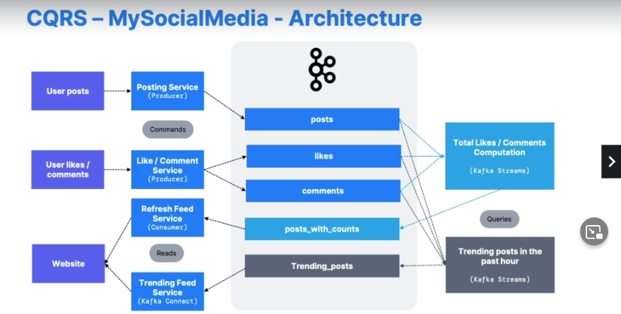

# Tips
## Choosing PartitionsCount and ReplicationFactor
Get it right the first time. Adding replication factor losses keyhashing
- Each partition can handle a throughout of few MBs. Measue setup
- Small cluster: <6 brokers: 3x of brokers
- Big cluster: >12 brokers: 2 of brokers
- Replication factor, at least 2, usually 3, maximum 4
- Higher replication factor higher acks and more disk space is used.
- If repli performance is issue get a better broker.
- Zookeeper maximum 200,000 partititons.
- Recommended maximum 4000 partitions per broker
- Kraft will potentily millison of partitions
- Netflix model if you need 200000 partitions, then scale clusters.

## Naming convention

# ProjectIdeas
## MovieFlix
- Make sure you can resume a video where left off
- Build user profile in real time
- Recommend the next show to user in real time
- Store all the data in analytics store

Topics:
1.show_position
- multiple producers
- if high volume > 30 partitions
- key is user_id
2. recommendations
- source data for analytical store and historic data
- low volume topic
- key is user_id

## GetTaxi
Match people with taxi drivers
- User should match with close by driver
- Pricing should surge if number of drivers low or high
- all the position data stored in analytics store for better cost

user_position and taxi_position should be different topics.
Out of that we get surge pricing. So we had surge pricing service that will combine  into sure topic.

Topics:
1. taxi_position, user_position
- high distribution volume > 30 partitions.
- keys are user_id and taxi_id
- ephemeral data not a long time
2. computation of surge comes from kafka streams
- surge can be regional and have high volume
- weather or events can be included in kafka streams application

## CQRS - MySocialMedia
- User can upload images, like and comment.
- User can see total number of likes, comments per post in real time
- High volume of data on first day
- See trending posts

Kafka streams performs aggregation of topics.
decouple collection from aggregation of data.

1. Responsabilities are segregated into CQRS - Command Query Responsibility
2. Posts
- Topics have multiple producers
- high distributed, high volume > 30 partitions
- key: user_id
- high retention period of data
3. Likes, Comments
- Topics with multiple producers
- high volume
- key: post_id
4. Data in kafka should be formatted as events
- User_123 created a post_id 456 at 2pm
- User_234 liked post_id 456 at 3pm
- User_234 deleted post_id 456 at 3pm

# Finance application - MyBank
Real time banking for its user. Alert users in case of large transactions

- Transaction data already exists in a database. Use CDC (Change data capture connectors)
- Thresholds can be defined by users
- Alerts must be sent in real time to users

Kafka stream, alerts for new transaction. Send as events
User 123 enabled threshodl 1000 at 12p, on julu 12 2018

# Kafka
Kafka was made for big data ingestion. Connect with generic connectrols and offload data from kafka to HDFS, Amazon s3, ElaaticSearch.
Ingestion buffer

Kafka was used for moving logs

# Kafka API
- Kafka Connect - External Source > Kafka > Kafkva > External SInk
- Kafka Stream > Data transformation, Kafka > Kafka
- Scheme Registry > Helps using Schema in Kafka

Connect uses workers to read data from db and send it to kafka, or send data from kafka to somewhere else.

