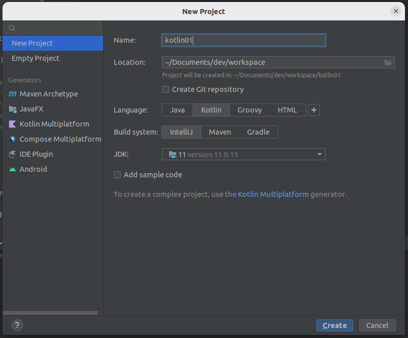

# Create basic project


# Create class and main
> src>main>kotlin > RC > Make Kotlin class
```
fun main() {
    println("Hello")
}
```

# Variables
Two types of variables:
- var - can be reassigned
- val - const, cannot be reassigned
```
fun main() {
    val greeting = "Hello "
    var name = "Bojan"
    // greeting = "val cannot be reassigned"
    println(greeting + name)
}
```
Variables created outside of the method scope are `top-level variables`
```
var name = ""
fun main() {
    name = "Bojan"
    println(name)
}
```

## Variable data types
- Types are non-nullable by default. String/Nullable string
- Datatypes are automatically inferred and cannot be changed afterwards 
```
# Type
val greeting: String = "Hello"
var name: String = "Bojan"

# Types cannot be reassigned
var name: String = "Bojan"
var test = "Test"
test = 1 // doesnt work

# non-nullable
var name: String = null     // doesnt work
var name: String? = null    // works

var name = null // Type: Nothing
name = "sss"    // Cant reassign

var n: String? = null
n = "bojan"
```

# Control statement
```
fun main() {
    // If
    var greeting: String = "bojan"
    if (greeting == null) {
        println("Null")
    }

    // When = Switch
    var example: Int = 1
    when (example) {
        null -> println("Null")
        1 -> println("Its 1")
        else -> println("Else")
    }

    // If for assignment
    var test: String? = null
    test = if(test != null) test else "Hi"
    println(test)

    // When for assigment
    var greet = when (greeting) {
        null -> "Hi"
        else -> greeting
    }
    println(greet)
}
```

# Functions
Function created outside of the method scope are `top-level functions`
## void functions
Unit is void type. If return type is not specified this one is used.
```
fun main() {
    voidFunction1()
    voidFunction2()
}

fun voidFunction1(): Unit {
    println("Doenst return anything")
}
fun voidFunction2() {
    println("Doenst return anything")
}
```

## functions with return type
```
fun main() {
    returnFunc1()
    returnFunc2()
}

fun returnFunc1():String {
    return "Hello"
}
fun returnFunc2():String? {
    return null
}
// Cant retun type, Unit is expected 
//fun willNotWork() {
//    return ""
//}
```

## Method arguments
You can imitate builder patter by having default named params
```
fun main() {
    // indexed params
    sayHello("Hello", "Bo", "Jan")
    
    // named params
    sayHello(greeting = "Hello", itemsToGreet = arrayOf("Bo", "Jan"))
    
    // with default values
    sayHello(itemsToGreet = arrayOf("Bo", "Jan"))
    
    // using spread operator for array params
    var items = arrayOf("Bo", "Jan")
    sayHello("Name", *items)
}

fun sayHello (greeting:String="Hello", vararg itemsToGreet:String) {
    itemsToGreet.forEach { itemsToGreet -> println("$greeting $itemsToGreet") }
}
```

## Single expression functions
Define function as single line expression
```
fun main() {
    println(singleExpression())
}
fun singleExpression():String = "Hello"
```
## Elvis operator. Ternary
If not null assigne left value. If null then right.
```
val nickk = nickName ?: "no nickname"
```

# String templates
```
var name: String = "bojan"
println("Hello $name")

# as func param
println(greet("bojan"))
fun greet(name:String):String {
    return "Hello $name"
}
fun greet(name:String):String = "Hello $name" 
```

# Collection
By default created collections are immutable. Call different method for mutable.
- val mList = mutableListOf("item1")
- val imList = listOf("item1")
- val imMap = mapOf("1" to "a", 2 to "b", "3" to 'c')
- val mMap = mutableMapOf("1" to "a", 2 to "b", "3" to 'c')
## Array
```
var items = arrayOf("Item1", "Item2", "Item3")
println(items.size)
println(items[0])
println(items.get(0))
for (item in items) {
    println(item)
}

// # ForEach
// It is default name of each name
items.forEach { println(it)}
items.forEach { someItem -> println(someItem)}
items.forEach { someItem ->
    run {
        println(someItem)
    }
}

// # Iterate with index
items.forEachIndexed{index, item -> println("$index is $item") }
```

## List
```
var items = listOf("Item1", "Item2", "Item3")
println(items[0])
println(items.get(0))

items.forEach{item -> println(item)}
```

## Map
```
val map = mapOf("1" to "a", 2 to "b", "3" to 'c')
println(map.get("1"))

map.forEach{key, value -> println("$key->$value") }
```