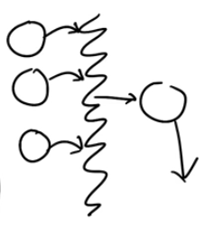

# AI vs ML vs NN
1. AI: is set of rules that automate to simulate intellectual task.
    - Even basic TicTacToe AI is still AI
    - You have a chess board. You send the state to app. Rule is king is attacked triggered and moves the piece.
2. ML: is subset of AI.
    - Gets input data, and what output needs to be. And generates rules by itself. Thats is ML Model.
    - Simulates human behavior

3. NN (Neural Networks): Subset of ML, that uses Layer Representation of data. Some people call it Multi Stage Information Extract Process.
    - ML consists of 1 input layer, 1 output layer. And rules in between.
    - NN has multiple transformation layer after input layer that transform the data
    - In transform layer, data is changed based on some rules
    - NN are inspired by biological behavior, but not actually the brain cause we dont know how fully how brain works

# Input and Output
- Features (Input) are input data, that we use to get a prediction.
- Label (Output) is the output
- When we give features to model it gives output.
